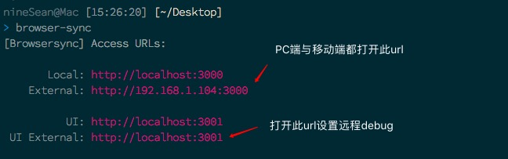
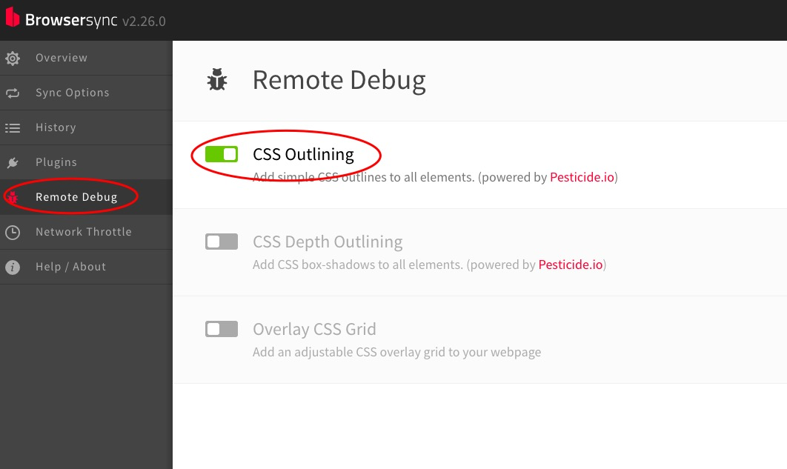

## 移动端开发

### 分类
- Native
    - 原生App
    - 使用Java/Object-C/Swift开发
- Webapp
    - 在手机浏览器上展示的网页
- Hybrid
    - 混合Naive + HTML + CSS
- 小程序
    - 微信平台提供接口的开发

### 对比
- 开发成本
    - 小程序&Webapp < Hybrid < Naive
- 更新
    - Native上线更新审批严格耗时，用户要不定期更新App；Webapp&小程序无需更新，Hybrid可实现热更新
- 性能体验
    - 由好到差 Native > Hybrid > Webapp
- 安装方式
    - Native与Hybrid需要下载安装，Webapp与小程序依附于浏览器与微信
- 跨平台
    - Webapp只需兼容不同的浏览器，适配Andriod与IOS

### 移动端 VS PC端
- CSS
    - PC端屏幕大，可以展示比较复杂的布局
    - 移动端屏幕小，只能展示有限的元素，适合通栏上下内嵌简单上下左右的布局
- JS
    - 移动端与PC端主要区别为touch事件
- 两端页面适配与差异
    - 简单页面适配使用媒体查询（@media），不同宽度适配不同CSS，HTML结构不变
    - 复杂的页面移动端与PC端各准备一套代码
    - 移动端多采取 rem + flex 布局
    - 移动端由于浏览器种类繁多而且或多或少对内核都有修改，导致需要比PC端付出更多做兼容

### touch事件
- touchstart
- touchend
- touchmove

### 300ms
- click event有300ms延时
- 浏览器为了区分用户的意图是双击放大屏幕还是click event
- 解决方案
    - fastclick.js
        - 解决300ms延时,点击后立即触发click回调
    - 当页面宽度等于设备宽度时，click将无300ms延时，设置如下
    
      ```html
      <meta name="viewport" content="width=device-width">
      ```
      
### 常用库
- [fastclick.js](https://github.com/ftlabs/fastclick)
- 手势
    - [hammer.js](http://hammerjs.github.io/) 
- 滚动
    - [iscroll.js](https://github.com/cubiq/iscroll)
- zepto
    - 精简版的jQuery，体积小

### 页面适配
- 设置meta标签
    - `width=device-width`
        - 设置网站的宽度为设备的宽度（页面展示不会再缩小，这是历史遗留问题，以前还没有移动端Web开发时，为了能在当时window砖头机、诺基亚等其它所有手机方便浏览网页，网页按照PC端的展示等比缩小以方便用户不用左右移动，想想当时手机屏大小和键盘操作）
    - `initial-scale=1.0` `maximum-scale=1.0` `user-scalable=no`
        - 初始缩放比例、最大缩放比例和用户可缩放
    - 代码示例：
    
    ```html
    <meta name="viewport" content="width=device-width, initial-scale=1.0, maximum-scale=1.0, user-scalable=no">
    ```

### REM 
- 用REM为单位设置字体或者宽高，则以根节点的`font-size`为基准
- 若以屏幕宽度为1REM，则可适配所有不同尺寸手机，代码如下：

    ```js
    let style = document.createElement('style')
    style.innerHTML = `
        html{
            font-size: ${document.documentElement.clientWidth}px
       }
    `
    document.head.appendChild(style)
    ```
    
    - [demo](http://js.jirengu.com/fekec/1/edit?html,css,js,output)


### 调试
- browser-sync
    - 可以实现PC端开发调试页面同步到手机端
- how

  > npm i -g browser-sync
  
  > browser-sync
      
    - 启动后命令行提示extenerl url，手机浏览器输入此url即可完成同步调试。
    - 
    - 
    - 原理

      > ifconfig

      - 可以发现路由器的IP就是extenerl url的IP
      - 显然手机是通过局域网发送请求到同个局域网下的电脑上请求到页面资源
      - 所以只要手机和电脑连接同一个WIFI即可
    
### [移动端开发大全](https://github.com/jtyjty99999/mobileTech/blob/master/README.md)


