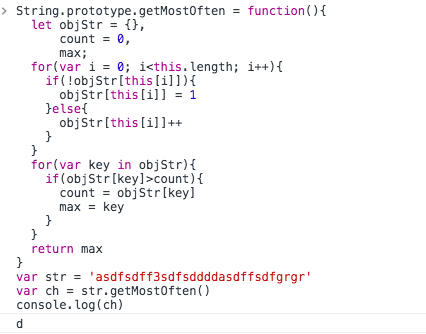

## 问答

---

### this相关问题

#### 1. apply、call 、bind有什么作用，什么区别 
* apply
  `fn.apply(object[, argArray])`调用fn函数，this指向object；第二个参数可选，但必须是个数组，数组中的值按顺序作为函数fn的实参传入。
* call
  call方法和apply基本一样，除了传参方式不以数组而是从第二个形参开始对应函数fn的第一个形参依次对应传入。
* bind
  bind方法和上面两个方法差不多，不过bind是返回改变了this指向的函数而不是执行。

### 2. 以下代码输出什么?

```
var john = { 
  firstName: "John" 
}
function func() { 
  alert(this.firstName + ": hi!")
}
john.sayHi = func
john.sayHi()
//John: hi!
```
* 弹窗显示John: hi!

#### 3. 下面代码输出什么，为什么

```
func() 
function func() { 
  alert(this
}
```

* 输出`window`,`this`只有在调用的时候才知道指向谁，上面代码的调用等同于`window.func.call()`，当`call`的第一个参数没有或者为`undefined`、`null`时`this`指向`window`

#### 4. 下面代码输出什么

```
document.addEventListener('click', function(e){
    console.log(this);
    setTimeout(function(){
            console.log(this);
                
    }, 200);

}, false);
```

* 当全局触发click事件，先打印`document`对象，200ms以后再打印出`window`

#### 5. 下面代码输出什么，why

```
var john = { 
  firstName: "John" 
  }

function func() { 
    alert( this.firstName  )
}
func.call(john)
```

* 弹窗输出`John`，call方法使this ——&gt; john

#### 6. 以下代码有什么问题，如何修改

```
var module= {
bind: function(){
$btn.on('click', function(){
      console.log(this) //this指什么
            this.showMsg();
                
})
  
},
  
  showMsg: function(){
      console.log('饥人谷');
        
  }

}
```
改后
```
var module= {
  bind: function(){
    var _this = this
    $btn.on('click', function(){
      console.log(this) //this指$btn
      _this.showMsg();
    })
  },
  
  showMsg: function(){
    console.log('饥人谷');
  }
}
```


### 原型链相关问题

#### 7. 有如下代码，解释Person、 prototype、__proto__、p、constructor之间的关联。

```
function Person(name){
    this.name = name;

}
Person.prototype.sayName = function(){
    console.log('My name is :' + this.name);

}
var p = new Person("若愚")
p.sayName();
```

* 构造函数`Person`的`prototype`对象自带`constructor`属性指向构造器`Person`，定义了`sayName`方法；`new`一个`Person`输入实参生成一个实例对象`p`，`p`的`__proto__`属性指向构造函数`Person`的`prototype`，`p.sayName()`先在自身的的方法里找，没有再寻着原型链往上找。

#### 8. 上例中，对对象 p可以这样调用 p.toString()。toString是哪里来的? 画出原型图?并解释什么是原型链。

* 原型链就是`__proto__`指向原型对象的一级一级继承关系形成的链，见下图：
  


#### 9. 对String做扩展，实现如下方式获取字符串中频率最高的字符

```
var str = 'ahbbccdeddddfg';
var ch = str.getMostOften();
console.log(ch); //d , 因为d 出现了5次
```
封装如下：
```
String.prototype.getMostOften = function(){
  let objStr = {},
      count = 0,
      max;
  for(var i = 0; i<this.length; i++){="" if(!objstr[this[i]]){="" objstr[this[i]]="1" }else{="" objstr[this[i]]++="" }="" for(var="" key="" in="" objstr){="" if(objstr[key]="">count){
      count = objStr[key]
      max = key
    }
  }
  return max
}
var str = 'asdfsdff3sdfsddddasdffsdfgrgr'
var ch = str.getMostOften()
console.log(ch)
```
如图：



#### 10. instanceOf有什么作用？内部逻辑是如何实现的？

* `instanceof`用来判断指定对象是否是构造函数的实例，实现逻辑是判断是否处于同一条原型链上即可，如下：

```
function instanceOf(obj, Fn){
	if(!obj || typeof obj === 'number' || typeof obj === 'string')
    return '请输入对象'

    let __proto__ = obj.__proto__
    do{
        if(__proto__ === Fn.prototype)
            return true
        else if(!__proto__)
            return false
    }while(__proto__ = __proto__.__proto__)
    return false
}
```

### 继承相关问题

#### 11. 继承有什么作用?

* 当一个构造函数的原型上定义了属性和方法，该构造器的实例可以直接继承构造器原型上的属性和方法不用另写，另外继承而来的属性方法指向构造器原型而节省了内存。

#### 12. 下面两种写法有什么区别?

```
//方法1
function People(name, sex){
    this.name = name;
        this.sex = sex;
        this.printName = function(){
                console.log(this.name);
                    
        }

}
var p1 = new People('饥人谷', 2)

//方法2
function Person(name, sex){
    this.name = name;
        this.sex = sex;

}

Person.prototype.printName = function(){
    console.log(this.name);

}
var p1 = new Person('若愚', 27);
```
* 方法一每`new`一个实例都会在实例对象上添加printName方法，而方法二在构造函数的原型上添加的printName方法则实例继承该方法从而节省内存。

#### 13. Object.create 有什么作用？兼容性如何？

* Object.create用来创建一个拥有指定原型的对象，亦可以给该对象设置属性，代码如下：
```
var cat = Object.create(Object.prototype, {
    name: {value: '旺财', writable: true, configurable: true}, 
    year: {value: '1岁', writable: true, configurable: true}
})
cat.name = 'lucy'
console.log(cat)
```
* 兼容性
  

#### 14. hasOwnProperty有什么作用？ 如何使用？
* `hasOwnProperty`返回一个布尔值，判断对象是否含有指定属性，该方法忽略掉继承的属性，用法如下：
```
function People(name){
    this.name = name
}
People.prototype.sayName = function(){
    console.log(`my name is ${this.name}`)
}
var gay = new People('gay')
gay.sayName()
console.log(gay.hasOwnProperty('sayName'))
```

#### 15. 如下代码中call的作用是什么?

```
function Person(name, sex){
    this.name = name;
        this.sex = sex;

}
function Male(name, sex, age){
    Person.call(this, name, sex);    //这里的 call 有什么作用
        this.age = age;

}
```
* `call`执行Person函数，this指向Male构造函数的实例，相当于把Person函数体里给实例添加属性的代码借来用。

#### 16. 补全代码，实现继承 

```
function Person(name, sex){
    // todo ...

}

Person.prototype.getName = function(){
    // todo ...

};    

function Male(name, sex, age){
   //todo ...

}

//todo ...
Male.prototype.getAge = function(){
    //todo ...

};

var ruoyu = new Male('若愚', '男', 27);
ruoyu.printName();
```
补全如下：
```
function Person(name, sex){
    this.name = name
    this.sex = sex
}

Person.prototype.getName = function(){
	return this.name
};   
Person.prototype.printName = function(){
    console.log(`my name is ${this.name}`)
} 

function Male(name, sex, age){
    Person.apply(this, arguments)
    this.age = age
}

Male.prototype = Object.create(Person.prototype)
Male.prototype.constructor = Male
Male.prototype.getAge = function(){
    console.log(`I am ${this.age} years old`)
};

var ruoyu = new Male('若愚', '男', 27);
ruoyu.printName();
```

---
**本文章著作权归九霄所有，转载须说明来源**

---


## 参考

---
[Object.create方法](https://developer.mozilla.org/zh-CN/docs/Web/JavaScript/Reference/Global_Objects/Object/create)

