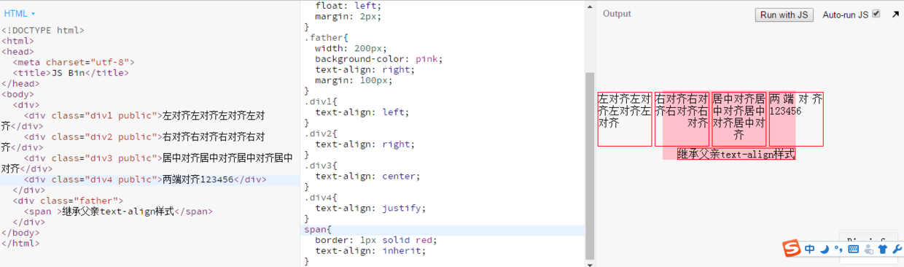
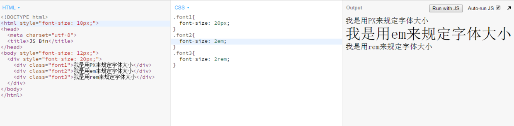
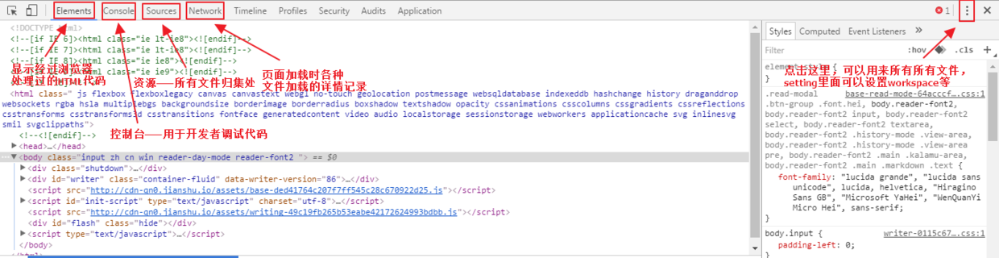

## 问答
### 1. 样式有几种引入方式? link 和 @import有什么区别？
样式的引入方法分5种，如下：
* 内联式
  直接写在标签里。如：
```
<p style="color: red;">红色</p>
```
* 嵌入式
  样式写在`<style></style>`内，为了不造成FOUC所以建议放在head标签内。如：
```
<head>
  <style>
    p{
      color: red;
    }
  </style>
</head>
```
* 外部link式
  样式用link标签链接。如：
```
<head>
  <link rel="stylesheet" type="text/css" href="style.css">
</head>
```
* 外部@import式
  @import url(文件路径)，但**不提倡使用**。属于样式语法，写在样式里面。如：
```
@import url(style.css)
```
* JavaScript式
  使用JS直接写样式。如：
```
document.getElementById("box").style.color="red";
```

 link 和 @import的区别
* 性质的差别。link属于XHTML标签，可以用来声明type类型、定义rel链接属性；而@import只是CSS提供的一种方式，只能作为加载CSS的一种语法。
  * 加载顺序的差别。link链接的CSS文件按照HTML代码执行顺序来加载；而@import只能在当前HTML代码执行完才能加载，这会造成FOUC现象。
  * 兼容性的差别。link属于XHTML标签，无兼容性问题；@import是在CSS 2.1提出的，只兼容IE5以上的浏览器。
  * 使用Dom控制样式的差别。@import只为CSS服务，所以在JS控制Dom改变样式，只能使用link标签。

### 2. 文件路径../main.css、./main.css、main.css、/main.css有什么区别

|   文件路径类型    |      区别       |
| :---------: | :-----------: |
| ../main.css | 上级目录的main.css |
| ./main.css  | 当前目录的main.css |
|  main.css   | 当前目录的main.css |
|  /main.css  | 根目录的main.css  |

### 3. console.log是做什么用的?
console.log()是向控制台输出一条消息，作用是让开发者调试代码。

### 4. text-align有几个值，分别有什么作用？写截图说明区别
text-align有5个值：left、center、right、justify、inherit。

|    值    |             描述              |
| :-----: | :-------------------------: |
|  left   |    把文本排列到左边。默认值：由浏览器决定。     |
|  right  |          把文本排列到右边。          |
| center  |          把文本排列到中间。          |
| justify |         实现两端对齐文本效果。         |
| inherit | 规定应该从父元素继承 text-align 属性的值。 |

如下图：

​    

### 5. px、em、rem分别是什么？有什么区别？如何使用

| 字体单位 |           解释           |                   区别                   |
| :--: | :--------------------: | :------------------------------------: |
|  px  |       像素(pixel)        |                  绝对大小                  |
|  em  | 相对最近已设置font-size祖先元素大小 |                  相对大小                  |
| rem  |        相对根元素大小         | 相对于em的相对大小，可以理解成以根元素大小作为统一标尺根据需要进行相对设置 |

如下图：

​    

### 6. 对chrome 审查元素的功能做个简单的截图介绍

​    

### 7. 如下代码，设置 p为几 rem，让h1和p的字体大小相等?
6rem。

## 代码
### 1. 设置body的字体为微软雅黑，字号16px， 行高1.5倍，字体颜色 #333
[task-1](http://js.jirengu.com/cemuxibepu/1/edit)
### 2.设置段落颜色#000, 首行缩进两个字体宽度，1.5倍行高
[task-2](http://js.jirengu.com/wufudekeqa/1/edit)

---
**本文章著作权归九霄所有，转载须说明来源**
