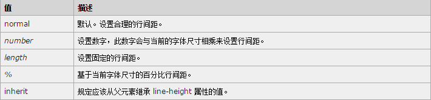
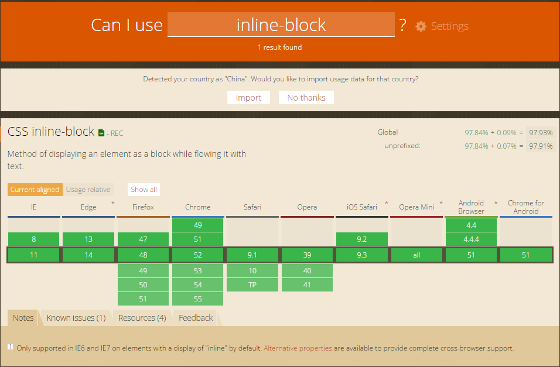
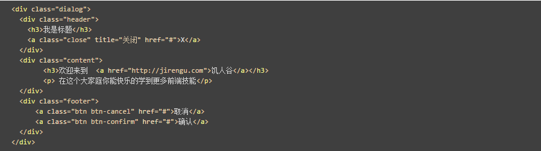
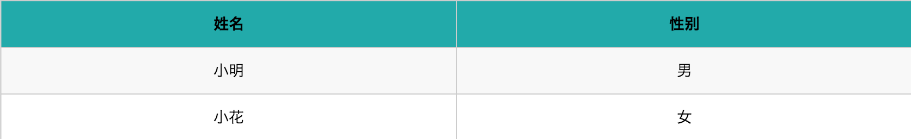
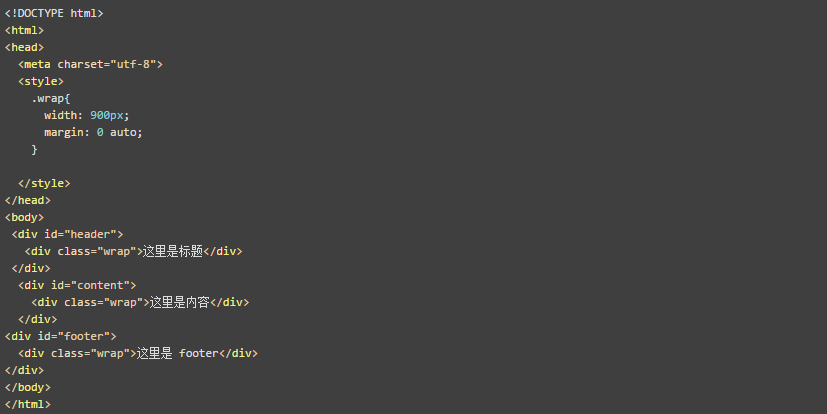

## 问答
### 1. line-height有什么作用?
line-height就是给文字设置行高，令行高等于高度可以实现元素垂直居中。line-height属性值如下：

​    

### 2. 如何去查CSS属性的兼容性？比如inline-block哪些浏览器支持？
[点击查看兼容性](http://caniuse.com/)

​    

点击show all查看主流浏览器所有版本兼容情况。

### 3. a 标签的href, title, target 是什么？ title 和 alt有什么区别？如何新窗口打开链接?

| a标签属性  |             值              |       作用        |
| :----: | :------------------------: | :-------------: |
|  href  |            url             | 规定链接指向的页面的 URL  |
| title  |       "text_content"       | 公有属性，设置相关性的文本描述 |
| target | _blank/_parent/ _self/_top |   规定在何处打开链接文档   |

title和alt的区别：title是当鼠标悬停在该a标签上方时会显示的描述内容；alt是img标签必需的属性，当图片无法显示时的替代文本。alt的属性值为搜索引擎提供数据。

在新窗口打开链接需要属性target的值设置为_blank，如下：
```
<a href="http://baidu.com" title="百度" target="_blank">XX</a>
```

### 4. display: none, visibility: hidden, opacity:0 有什么作用？有什么区别？
这些语法都能让元素隐藏，区别如下：

|       属性/值对        |        区别         |
| :----------------: | :---------------: |
|   display: none    |  隐藏后元素脱离文档流，不占位置  |
| visibility: hidden | 不可见，没脱离文档流，仍然占位置  |
|     opacity:0      | 完全透明，未脱离文档流，仍然占位置 |

### 5. 如何去除 a 链接的默认样式？直接在 a 链接父容器添加颜色，能否继承到当前 a 链接上？
去除a链接的默认样式，代码如下：
```
a{
   text-decoration: none;
}
```
a标签的颜色只能写在当前元素的样式里，无法继承。

## 代码
### 1. 写个div，边框为1px, #ccc, 宽度为200px, 高度为80px, 内有一行文字这里是饥人谷，文字字体大小14px, 颜色#f0f, 文字在div里垂直水平居中
#### [task6-1](http://js.jirengu.com/kosogihole/1/edit)
### 2. 对于如下html代码
* 给.dialog加个边框 1px, #ccc
* 给header设置高度40px, 左对齐，左内边距10px, 文字16px, 颜色#f00,下边框#ccc 1px。
* 给content 设置高度100px,内部 a链接去掉下划线，颜色 blue, 鼠标放置上去后颜色变为 red
* 给footer设置高度50px，内部 btn设置 边框1px #ccc, 圆角3px, 上下内边距4px,左右内边距3px，显示为inline-block, footer内居中显示;

​    

#### [task6-2](http://js.jirengu.com/vudaviraqo/1/edit?html)
### 3. 写一个如下表格
表头是蓝色，表行是白色。 当鼠标放置到表行时背景色变为淡灰色

​    

#### [task6-3](http://js.jirengu.com/zigidijohi/1/edit?html,output)
### 4. 下面代码有什么作用？手抄一遍如下代码，改变浏览器宽度看看效果

  

效果：自上而下3个盒子，宽度900px、左右居中对齐；但文字在盒子中默认左对齐。
#### [task6-4](http://js.jirengu.com/jamureveca/1/edit?html)

---
**本文章著作权归九霄所有，转载须说明来源**
