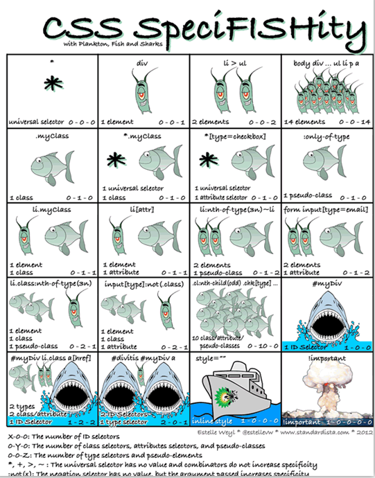
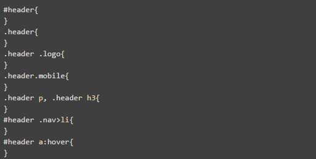
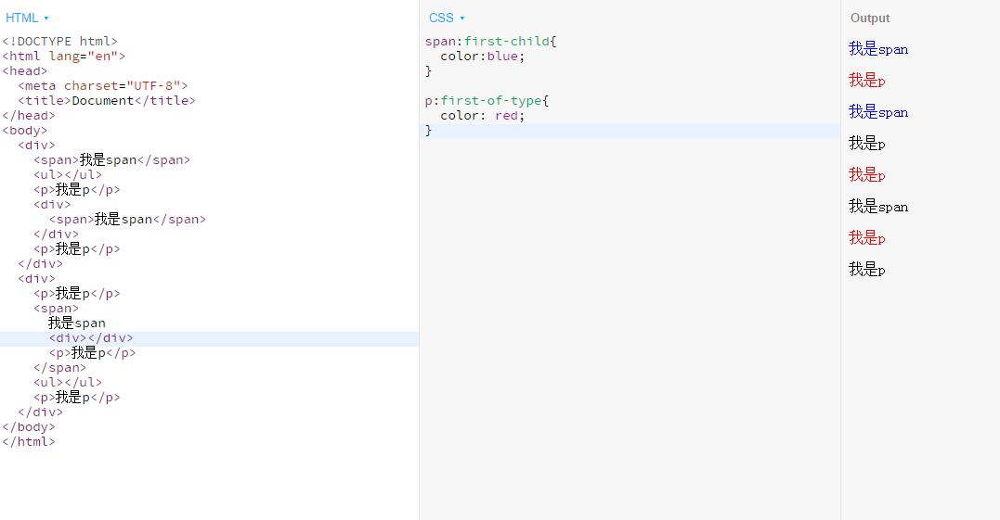
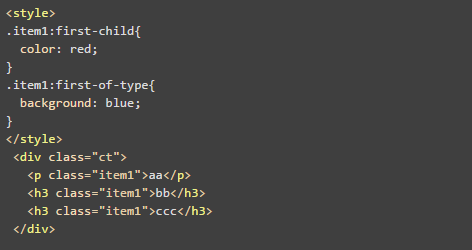
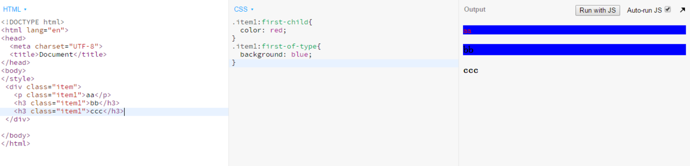
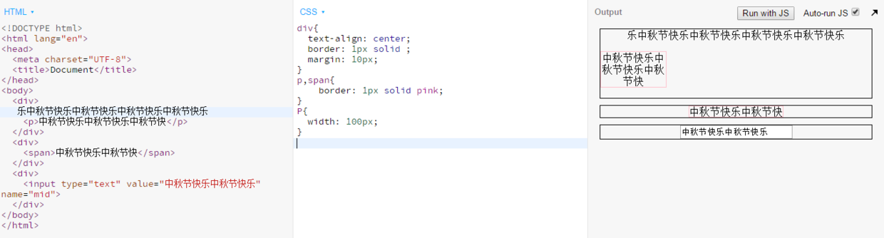
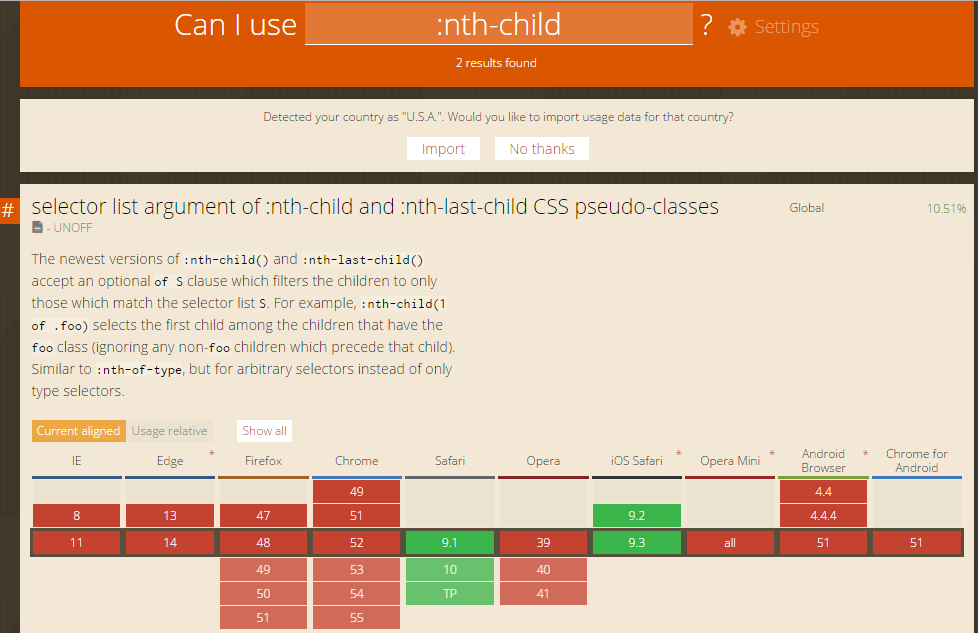

## 背景
---
> CSS 是开放网络 *open web* 的核心语言之一，由 [W3C 规范](http://w3.org/Style/CSS/#specs) 进行标准化。CSS 分为不同等级，CSS1 现已废弃， CSS2.1 是推荐标准， [CSS3](https://developer.mozilla.org/zh-CN/docs/CSS/CSS3) 分成多个小模块，正在标准化中。

## CSS定义
---
> **层叠样式表** (Cascading Style Sheets)，常缩写为 **CSS，** 是一门 [样式表 (stylesheet)](https://developer.mozilla.org/zh-CN/docs/DOM/stylesheet) 语言，用来描述 [HTML](https://developer.mozilla.org/zh-CN/docs/HTML)、[XML](https://developer.mozilla.org/zh-CN/docs/XML)（包括各种 XML 语言如 [SVG](https://developer.mozilla.org/zh-CN/docs/SVG)、[XHTML](https://developer.mozilla.org/zh-CN/docs/XHTML)）文档的呈现。CSS 描述了在屏幕、电子纸、音频或其它媒体上**如何渲染元素**。

## 问答
---
### 1. CSS选择器常见的有几种?
常见的选择器有**基础选择器**、基于关系的**组合选择器**、**属性选择器**、**伪类选择器**、**伪元素**，下面列举部分说明。
* 基础选择器

|   基础选择器   |          含义          |              实例              |
| :-------: | :------------------: | :--------------------------: |
|     p     |    标签选择器，匹配p标签元素     |        p{color: red;}        |
|   .boy    |   类选择器，匹配类名为boy的元素   | .classname{font-size: 12px;} |
| `#`header | Id选择器，匹配Id为header的元素 |   #idname{margin: 0 auto;}   |
|     *     |    通配符选择器，匹配所有元素     |   *{margin: 0;padding: 0;}   |

* 组合选择器

| 组合选择器 |         含义          |                    实例                    |
| :---: | :-----------------: | :--------------------------------------: |
|  A>B  | 子代选择器，匹配父元素为A的所有B元素 |       div>.boy{font-family: "黑体";}       |
|  A B  |  后代选择器，匹配A元素下所有B元素  |         div p{font-weight: 700;}         |
|  A,B  |  多元素选择器，匹配所有A和B元素   | .header,.content{border: 1px solid pink;} |
|  A+B  |    所有紧跟着A元素的B元素     |      div+p{background-color: #ccc;}      |
|  A~B  |   所有兄长元素为A元素的B元素    |      span~a{text-decoration: none;}      |

* 属性选择器

|  属性选择器  |                  含义                  |        实例        |
| :-----: | :----------------------------------: | :--------------: |
|  E[A]   |              所有属性有A的E元素              |  input[target]   |
| E[A=b]  |           所有属性A的属性值为b的E元素            | input[type=text] |
| E[A~=b] |         所有属性A的属性值包含了单词b的E元素          |   p[title=car]   |
| E[A｜=b] | 所有属性A的首个属性值为b（包括属性值以b-开头，即b-c亦可）的E元素 |   p[lang｜=en]    |

* 伪类选择器

|   伪类选择器    |                    含义                    |                  实例                  |
| :--------: | :--------------------------------------: | :----------------------------------: |
|   E:link   |               匹配所有未被点击的链接                |        a:link{color: black;}         |
| E:visited  |               匹配所有已被点击的链接                |       a:visited{color: blue;}        |
|  E:hover   |               匹配鼠标悬停其上的E元素               | span:hover{background-color: pink;}  |
|  E:active  |            匹配鼠标已经按下、还没有释放的E元素            |       a:active{color: yellow;}       |
|  E:focus   |               匹配获得当前焦点的E元素               | input:focus{background-color: gray;} |
| E:lang(it) | 匹配属性lang首个属性值为it(包括属性值以it-开头，即it-us亦可)的E元素 |   p:lang(it){text-align: center;}    |

* 伪元素

|       伪元素       |      含义      |                    实例                    |
| :-------------: | :----------: | :--------------------------------------: |
|    E::after     | 在E元素后面插入生成内容 | .txt::after{content: "";width:0;height:0;position:absolute;border-bottom:10px solid #ccc;} |
|    E::before    | 在E元素前面插入生成内容 | .txt::before{content: "";width:0;height:0;position:absolute;border-bottom:10px solid #ccc;} |
| E::first-letter |  匹配E元素第一个字母  |       p::first-letter{color:pink;}       |
|  E::first-line  |  匹配E元素第一行内容  |        p::first-line{color:pink;}        |

### 2. 选择器的优先级是怎样的?
各种类型选择器、行内样式的权重可以参照下面的趣味图：

  

选择器的优先级有3个原则：
* 选择器越精确优先级越高（权重越高优先级越高）
* 下面比上面优先级高
* ！important优先级最高
### 3. class 和 id 的使用场景?

|  选择器  |           适用范围           |
| :---: | :----------------------: |
| 类选择器  |       一般用于小区块、公共样式       |
| Id选择器 | 一般用于宏观布局和页面结构的样式、DOM定位节点 |
### 4. 使用CSS选择器时为什么要划定适当的命名空间？
语义化的命名可以使机器、开发者、用户更好的理解代码或页面，提高了效率就创造了价值。
### 5. 以下选择器分别是什么意思?

  

|           选择器            |                 含义                 |
| :----------------------: | :--------------------------------: |
|        ` #header`        |           Id名为header的元素            |
|        ` .header`        |            类名为header的元素            |
|     ` .header .logo`     |      类名为header的后代中类名为logo的元素       |
|    ` .header.mobile`     |        类名为header且为mobile的元素        |
| ` .header p, .header h3` |      类名为header的后代中所有的p、h3标签元素      |
|    ` #header .nav>li`    | Id名为header的后代中类名为nav的子元素中所有的li标签元素 |
|    ` #header a:hover`    | Id名为header的所有a标签元素后代再匹配鼠标悬停在该a标签上  |

### 6. 列出你知道的伪类选择器
见题1中的伪类选择器，这里再补充一些：

|        伪类选择器        |           含义           |
| :-----------------: | :--------------------: |
|    E:first-child    |       长子中所有的E元素        |
|   E:nth-child(n)    |      兄弟中排第n的所有E元素      |
| E:nth-last-child(n) | 和上面的差不多，只不过n是从最后一个兄弟数起 |
|  E:nth-of-type(n)   |    同类型元素中排名第n的所有E元素    |
|   E:first-of-type   |    同类型元素中的所有为E元素的长子    |
|   E:last-of-type    |   同类型元素中的所有为E元素最小的儿子   |
|       E:empty       |       没有后代的所有E元素       |
|      E:target       |      已触发锚链接的目标E元素      |
|      E:checked      |       已被选的所有E元素        |
|      E:enabled      |       在启用的所有E元素        |
|     E:disabled      |       在禁用的所有E元素        |

### 7. :first-child和:first-of-type的作用和区别

|      伪类选择器      |         含义         |         区别         |
| :-------------: | :----------------: | :----------------: |
|  E:first-child  |    选择长子中所有的E元素     |   所有兄弟中的长子且是E元素    |
| E:first-of-type | 选择同类型元素中的所有为E元素的长子 | 只是同类型元素的兄弟中为E元素的长子 |
图解如下：

  

### 8. 运行如下代码，解析下输出样式的原因。

  

  

`.item1:first-child`——所有类名为item的长子只有`
aa
`。
`.item1:first-of-type`——所有同类型为p类型/标签元素中类名为item1的长子只有`
aa
`，所有同类型为h3类型/标签元素中类名为item1的长子只有`<h3 class="item1">bb</h3>`。
故aa字体红色、背景蓝色，bb背景蓝色。

### 9. text-align: center的作用是什么，作用在什么元素上？能让什么元素水平居中
text-align:center规定**行内内容**相对父元素居中对齐，测试text-align: center在块级元素、行内元素、行内块元素的效果如下：

  

显然，所谓**行内内容**包括**行内元素**、**行内块元素**和**行内文本**。

### 10. 如果遇到一个属性想知道兼容性，在哪查看?
[点击查看兼容性](http://caniuse.com)，如下：

  

##　参考
---
* [CSS 选择器参考手册](http://www.w3school.com.cn/cssref/css_selectors.ASP)
* [选择器- Web开发者指南](https://developer.mozilla.org/zh-CN/docs/Web/Guide/CSS/Getting_started/Selectors)
* [CSS选择器笔记](http://www.ruanyifeng.com/blog/2009/03/css_selectors.html)
* [有趣：256个class选择器可以干掉1个id选择器](http://www.zhangxinxu.com/wordpress/2012/08/256-class-selector-beat-id-selector/)

---
**本文章著作权归九霄所有，转载须说明来源**
