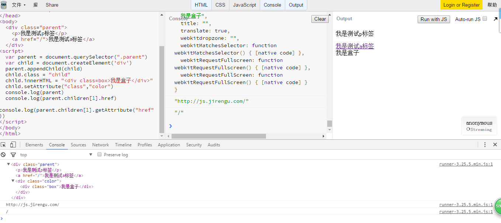
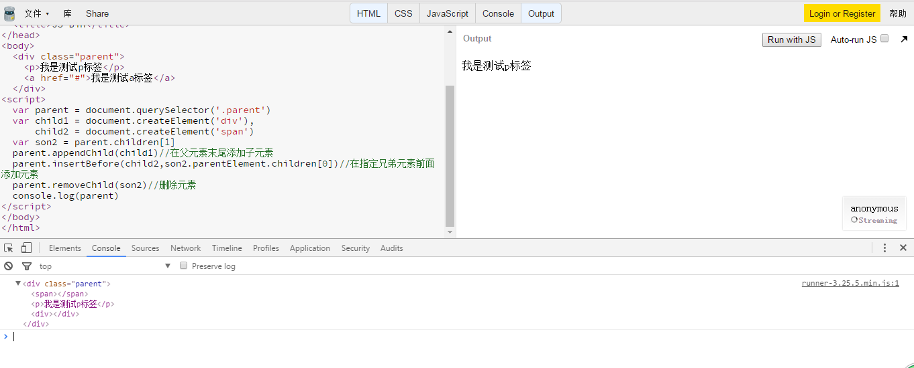
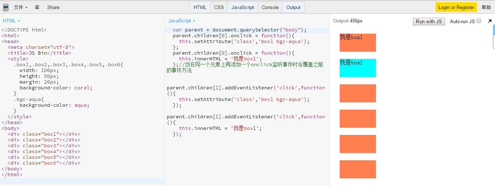

## 问答

---
### 1. dom对象的`innerText`和`innerHTML`有什么区别？
|    DOM对象     |             区别              |
| :----------: | :-------------------------: |
|  innerText   |          输出/更改纯文本           |
|  innerHTML   | 不仅可以输出/更改纯文本，还可以输出/更改DOM节点树 |
| innerContent | 用法与innerText一样，区别在于能输出隐藏文本  |

### 2. `elem.children`和`elem.childNodes`的区别？
|        属性         |                   区别                    |
| :---------------: | :-------------------------------------: |
|  `elem.children`  | 只是输出父节点包含的子节点组成的类数组（和数组很像，但是缺少数组的一些方法）。 |
| `elem.childNodes` |   输出父节点包含的所有元素（包括空格、换行、文本、子节点）组成的类数组。   |

### 3. 查询元素有几种常见的方法？
* `document.getElementById()`
  通过ID查找，因为ID只能用一次，故能够实现精确查找到该DOM节点。返回值为单个元素。
* `document.getElementsByClassName()`
  通过class查找，与ID不同的是，class能够匹配多个DOM节点，故返回的是一个类数组。
* `document.getElementsByTagName()`
  同class一样，tag作为标签能够匹配多个节点，故返回的也是类数组。

以上三者内部参数都是以字符串名传入。

**新方法：**

* `document.querySelector()`
* `document.querySelectorAll()`

这俩均能查找任何标签、class、id，写法与CSS选择器一样；区别在于前者返回单个元素，当遇到重名时，返回第一个元素。而后者返回包含所有元素的数组。

### 4. 如何创建一个元素？如何给元素设置属性？
```
step one:
`document.createElement()`创建元素
step two:
`parent.appendChild()`把创建的元素插入到DOM树中
step three:
`element.propertyName = "value"`或者`element.setAttribute("name","value")`设置属性
```
举例如下：


[代码](http://js.jirengu.com/yehisejoce/1/edit?html,console,output)


### 5. 元素的添加、删除？
* 添加
  `parent.appendChild()`
  `parent.insertBefore(插入元素,标记节点)`

* 删除
  `parent.removeChild()`

示例：


[代码](http://js.jirengu.com/qimicelolo/3/edit)


### 6. DOM0 事件和DOM2级在事件监听使用方式上有什么区别？
以click事件为例

* DOM0事件监听
```javascript
element.onclick = function(){
//to do
}
```

* DOM2事件监听
```javascript
element.addEventListener('click',function(){
//to do
})
```

两者差异在于DOM2可以拥有无数个click事件的方法，当click触发时，同时所有的方法都能使用；而给DOM0添加新的事件方法时，老方法将被新方法所覆盖。
示例：


[代码](http://js.jirengu.com/riqivanufo/1/edit?html,js,output)

### 7. `attachEvent`与`addEventListener`的区别？

* `attachEvent`是老版本IE浏览器上监听事件的方法
* `addEventListener`是现代大多数逐渐主流浏览器（Chrome,firefox,safari）监听事件的方法

区别在于：

1.**参数差异**：`addEventListener(eventType,function(){},bollean)`传递三个参数参数，而`attachEvent('on'+eventType,function(){})`只传递两个参数;`addEventListener(eventType,function(){},bollean)`前两个参数的意思与`attachEvent('on'+eventType,function(){})`的意思一样，只不过`attachEvent('on'+eventType,function(){})`事件名称前需要多加一个`on`；`addEventListener(eventType,function(){},bollean)`第三个参数传递的是布尔数，所代表的是冒泡型（false）还是捕获型（true），默认值为false；而`attachEvent('on'+eventType,function(){})`只有一种方法，即冒泡型。

2.**处理顺序差异**：若为同一事件添加多个处理函数时，`addEventListener()`是按照书写顺序由上往下依次执行，而`attachEvent()`没有规定顺序，全部随机排列；

3.**作用域差异**:`addEventListener()`的作用域是元素本身，this是指的触发元素，而`attachEvent()`事件处理程序会在全局变量内运行，this是window。


### 8. 解释IE事件冒泡和DOM2事件传播机制？

* 历史背景
  微软和网景对事件传播方式采有两种截然不同的方法：微软采取了事件冒泡型，而网景则采用了事件捕获型。
  随着历史的发展，DOM2事件传播机制诞生了：它包含了事件捕获型和事件冒泡型，开发者可以根据需要手动的选择采用何种类型传播事件。

* 事件冒泡型
  事件由触发元素所在的具体节点开始，逐级向上传播，直至html根节点。
* 事件捕获型
  事件由html根节点开始，层级下查，直至找到触发元素所在的具体节点。
* DOM2
  先由html根节点通过事件捕获至具体触发元素所在的节点，再由该节点通过事件冒泡至html根节点。
  由`addEventListener()`的第三个参数true/false（捕获/冒泡 default=false），来选择具体由何种方式触发。

### 9. 如何阻止事件冒泡？ 如何阻止默认事件？

* 阻止事件冒泡

* DOM事件对象：`event.stopPropagation();`
* IE事件对象：`event.cancelBubble = true;` //该属性默认为false

* 阻止默认事件

* DOM事件对象：`event.preventDefault();`
* IE事件对象：`event.returnValue = false;` //该属性默认为true

## 代码

---
## 1. 有如下代码，要求当点击每一个元素`li`时控制台展示该元素的文本内容。不考虑兼容

```javascript
<ul class="ct">
    <li>这里是</li>
    <li>饥人谷</li>
    <li>前端6班</li>
</ul>
<script>
//todo ...
</script>
```

### [task22-1 code](https://github.com/jirengu-inc/jrg-renwu7/blob/master/members/%E8%B5%96%E9%9C%84/task-22/task22-1.html)
### [task22-1 preview](http://book.jirengu.com/jirengu-inc/jrg-renwu7/members/%E8%B5%96%E9%9C%84/task-22/task22-1.html)

## 2. 补全代码，要求：
1.当点击按钮`开头添加`时在`<li>这里是</li>`元素前添加一个新元素，内容为用户输入的非空字符串；当点击`结尾添加`时在`<li>前端6班</li>`后添加用户输入的非空字符串.
2.当点击每一个元素`li`时控制台展示该元素的文本内容。

```javascript
<ul class="ct">
    <li>这里是</li>
    <li>饥人谷</li>
    <li>前端6班</li>
</ul>
<input class="ipt-add-content" placeholder="添加内容"/>
<button id="btn-add-start">开头添加</button>
<button id="btn-add-end">结尾添加</button>
<script>
//todo ...
</script>
```

### [task22-2 code](https://github.com/jirengu-inc/jrg-renwu7/blob/master/members/%E8%B5%96%E9%9C%84/task-22/task22-2.html)
### [task22-2 preview](http://book.jirengu.com/jirengu-inc/jrg-renwu7/members/%E8%B5%96%E9%9C%84/task-22/task22-2.html)

## 3. 补全代码，要求：当鼠标放置在`li`元素上，会在`img-preview`里展示当前`li`元素的`data-img`对应的图片。

```javascript
<ul class="ct">
    <li data-img="1.png">鼠标放置查看图片1</li>
    <li data-img="2.png">鼠标放置查看图片2</li>
    <li data-img="3.png">鼠标放置查看图片3</li>
</ul>
<div class="img-preview"></div>
<script>
//todo ...
</script>
```

### [task22-3 code](https://github.com/jirengu-inc/jrg-renwu7/blob/master/members/%E8%B5%96%E9%9C%84/task-22/task22-3.html)
### [task22-3 preview](http://book.jirengu.com/jirengu-inc/jrg-renwu7/members/%E8%B5%96%E9%9C%84/task-22/task22-3.html)

## 4. 实现如下图Tab切换的功能
[Tab切换的功能](http://7xnk1s.com2.z0.glb.qiniucdn.com/tab.gif)

### [task22-4 code](https://github.com/jirengu-inc/jrg-renwu7/blob/master/members/%E8%B5%96%E9%9C%84/task-22/task22-4.html)
### [task22-4 preview](http://book.jirengu.com/jirengu-inc/jrg-renwu7/members/%E8%B5%96%E9%9C%84/task-22/task22-4.html)

## 5. 实现下图的模态框功能
[模态框功能](http://7xnk1s.com2.z0.glb.qiniucdn.com/dialog.gif)

### [task22-5 code](https://github.com/jirengu-inc/jrg-renwu7/blob/master/members/%E8%B5%96%E9%9C%84/task-22/task22-5.html)
### [task22-5 preview](http://book.jirengu.com/jirengu-inc/jrg-renwu7/members/%E8%B5%96%E9%9C%84/task-22/task22-5.html)


## 参考

---
[浅谈事件冒泡与事件捕获](https://segmentfault.com/a/1190000000749838)

[mouseover与mouseenter的区别](http://www.cnblogs.com/libmw/articles/2600747.html)
[]()

[]()
[]()

---
**本文章著作权归九霄所有，转载须说明来源**
