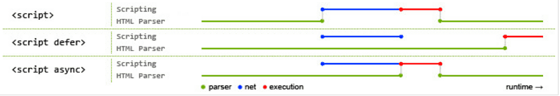
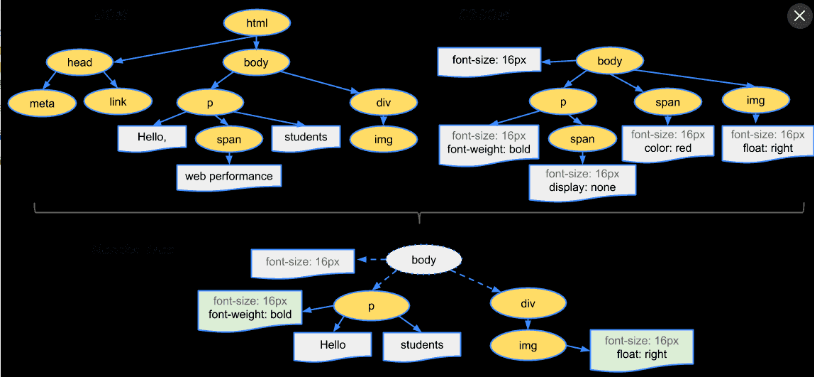

## 问答

---
### 1. CSS和JS在网页中的放置顺序是怎样的？
* CSS一般放置在head标签里面，样式先行的话在加载HTML内容时可以同时渲染样式，避免FOUC。
  * JS一般放在body标签后面，JS属于阻塞加载，如果放置在前面则必须等待JS文件加载、解析，这无疑影响页面加载速度；再者JS里面要操作节点也要等待HTML先行加载。

### 2. 解释白屏和FOUC
* 白屏
    白屏是由于渲染时间过长导致浏览器视窗出现白屏现象——一片空白。
    将CSS放在底部、使用@import引用样式等都可能导致白屏。
* FOUC
    FOUC为Flash of unstyled content的缩写，译作无样式内容闪烁。
    由于先加载HTML内容后再加载CSS对无样式的HTML进行渲染产生的闪烁现象。
    将CSS放在底部可能引起FOUC。

### 3. async和defer的作用是什么？有什么区别
  JS外部引用的三种方式：

*  `<script src="script.js"></script>`
    浏览器会立即加载并执行文件脚本，此过程不等后续HTML元素的加载而立即加载执行。
*  `<script async src="script.js"></script>`
    浏览器会等到后续HTML元素一起加载并立即执行脚本。
*  `<script defer src="script.js"></script>`   
    浏览器会延迟到与后续HTML元素一起加载并在所有元素解析完之后才执行脚本。
    参见下图：

  

### 4. 简述网页的渲染机制

  1. 解析HTML，形成DOM树；
  2. 解析CSS，形成CSSOM树；
  3. 两者进行合成渲染，形成渲染树；
  4. 渲染树在浏览器中进行定位布局，最终将页面呈现在浏览器上。
    参见下图：




### 5. JavaScript 定义了几种数据类型? 哪些是简单类型?哪些是复杂类型?
  JavaScript定义了6种数据类型，如下表

|     数据类型     |            描述            |  分类  |
| :----------: | :----------------------: | :--: |
|  数值（number）  |     整数和小数（比如1和3.14）      | 简单类型 |
| 字符串（string）  | 字符组成的文本（比如”Hello World”） | 简单类型 |
| 布尔值（boolean） |  true（真）和false（假）两个特定值   | 简单类型 |
|  undefined   |  表示“未定义”或不存在，即此处目前没有任何值  | 特殊值  |
|     null     |   表示空缺，即此处应该有一个值，但目前为空   | 特殊值  |
|  对象（object）  |         各种值组成的集合         | 复杂类型 |

其中对象又包括三种子类型：狭义的对象（object）、数组（array）、函数（function）。


### 6. NaN、undefined、null分别代表什么?
* NaN
    not a number的缩写，NaN 属性的初始值就是 NaN，和 Number.NaN 的值一样。
    在编码很少直接使用到 NaN。通常都是在计算失败时，作为 Math 的某个方法的返回值出现的（例如：Math.sqrt(-1)）或者尝试将一个字符串解析成数字但失败了的时候（例如：parseInt("blabla")）。
    等号运算符（== 和 ===） 不能被用来判断一个值是否是 NaN。必须使用 Number.isNaN() 或 isNaN() 函数。
* undefined
    undefined是指已经声明但未赋值的变量。
    undefined是一个表示”无”的原始值，转为数值时为NaN。
* null
    null是一个表示”无”的对象，转为数值时为0。
    null表示空值，即该处的值现在为空。比如，调用函数时，不需要传入某个参数，这时就可以传入null。
    查询null的类型，JS返回object。

### 7. typeof和instanceof的作用和区别?
*   typeof
    typeof操作符返回一个字符串,指示未经计算的操作数的类型。
    返回类型为题5涉及的几种数据类型。
* instanceof
    instanceof运算符用来测试一个对象在其原型链构造函数上是否具有prototype属性。
    语法：`object instanceof constructor`
    它是用来判断constructor.prototype是否存在于object的原型链上,返回值为true/false。
    如下：

    ```javascript
    // 定义构造函数
    function C(){}
    function D(){}

    var o = new C();

    // true，因为 Object.getPrototypeOf(o) === C.prototype
    o instanceof C;

    // false，因为 D.prototype不在o的原型链上
    o instanceof D;

    o instanceof Object; // true,因为Object.prototype.isPrototypeOf(o)返回true
    C.prototype instanceof Object // true,同上

    C.prototype = {};
    var o2 = new C();

    o2 instanceof C; // true

    o instanceof C; // false,C.prototype指向了一个空对象,这个空对象不在o的原型链上.

    D.prototype = new C(); // 继承
    var o3 = new D();
    o3 instanceof D; // true
    o3 instanceof C; // true
    ```


## 代码

---
### 1. 完成如下代码判断一个变量是否是数字、字符串、布尔、函数 （难度*）
```JavaScript
function isNumber(el){
    if(typeof el === "number"){
        return true;
    }else{
        return false;
    }
}
function isString(el){
    if(typeof el === "string"){
        return true;
    }else{
        return false;
    }
}
function isBoolean(el){
    if(typeof el === "boolean"){
        return true;
    }else{
        return false;
    }
}
function isFunction(el){
    if(typeof el === "function"){
        return true;
    }else{
        return false;
    }
}

var a = 2,
    b = "jirengu",
    c = false;
alert( isNumber(a) );  //true
alert( isString(a) );  //false
alert( isString(b) );  //true
alert( isBoolean(c) ); //true
alert( isFunction(a)); //false
alert( isFunction( isNumber ) ); //true
```

### 2. 以下代码的输出结果是?（难度**）
```JavaScript
console.log(1+1);//2
console.log("2"+"4");//24
console.log(2+"4");//24
console.log(+new Date());//从1970年1月1日至现在的毫秒数，输出每时每刻都不一样
console.log(+"4");//4
```

### 3. 以下代码的输出结果是? （难度***）
```JavaScript
var a = 1;
a+++a;//结果为3，a+先运算再自增，+a先自增再运算，故1+2===3

typeof a+2;//先执行typeof a为number，number+2结果为number2
```

### 4. 遍历数组，把数组里的打印数组每一项的平方 （难度**）
```JavaScript
var arr = [3,4,5]
for(i= 0;i< arr.length;i++){
    console.log(Math.pow(arr[i],2))
}
// 输出 9, 16, 25
```

### 5. 遍历 JSON, 打印里面的值 （难度**）
```JavaScript
var obj = {
    name: 'hunger',
    sex: 'male',
    age: 28
}

for(var keys in obj){
    console.log(keys+":"+obj[keys]);
};
// 输出 name: hunger, sex: male, age:28
```

### 6. 下面代码的输出是? 为什么 （难度***）
```JavaScript
console.log(a);//undefined,变量声明提升
var a = 1;
console.log(a);//1，上行代码声明变量a并赋值为1
console.log(b);//error,b is not defined。变量b未声明故报错
```

## 参考

---
[How browsers work](http://taligarsiel.com/Projects/howbrowserswork1.htm)

[defer和async的区别](https://segmentfault.com/q/1010000000640869)

[《JavaScript 标准参考教程（alpha）》](http://javascript.ruanyifeng.com/grammar/types.html#toc2)

[NaN](https://developer.mozilla.org/zh-CN/docs/Web/JavaScript/Reference/Global_Objects/NaN)

[instanceof](https://developer.mozilla.org/zh-CN/docs/Web/JavaScript/Reference/Operators/instanceof)

---
**本文章著作权归九霄所有，转载须说明来源**
