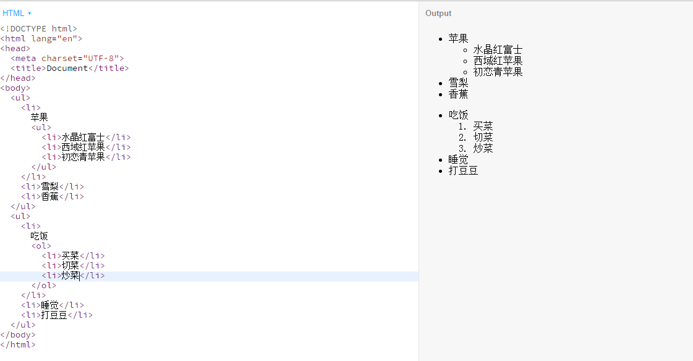
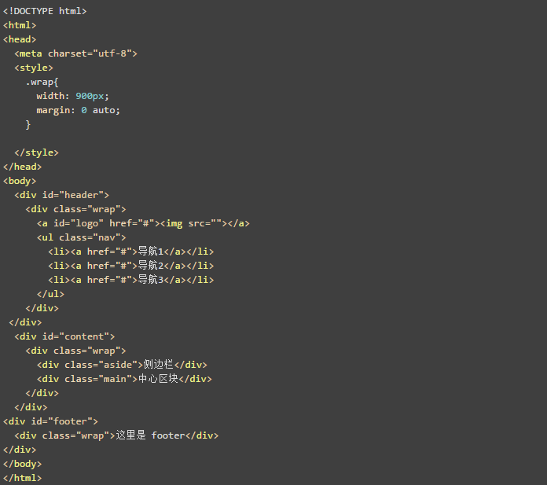
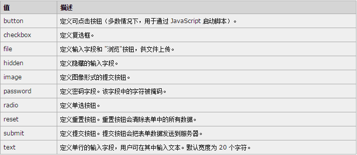
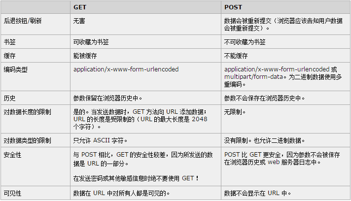
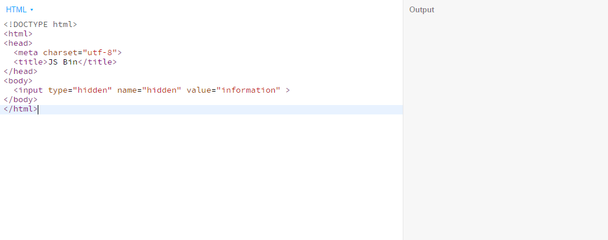

##问答
### 1. 有序列表、无序列表、自定义列表如何使用？写个简单的例子。三者在语义上有什么区别？在哪些情况下使用哪种（重要）？ 如何嵌套？
* 有序列表
  ol—ordered list，逻辑上有先后顺序的内容使用有序列表呈现。代码如下：
```
<!-- 如何把大象放冰箱里-->
  <ol>
    <li>开冰箱门</li>
    <li>把大象放进去</li>
    <li>用力关冰箱</li>
  </ol>
```

* 无序列表
  ul—unordered，逻辑上无先后顺序的内容用无序列表列举。代码如下：
```
    <ul>
      <li>苹果</li>
      <li>雪梨</li>
      <li>香蕉</li>
    </ul>
```

* 自定义列表
  dl—defined list(described list)，dt(defined item)定义一个东西，dd(described data)用于描述、解释、说明这个东西。代码如下：
```
  <dl>
    <dt>精通</dt>
    <dd>html</dd>
    <dd>css</dd>
    <dd>JavaScript</dd>
  </dl>  
```

* 嵌套
  如果某一个li标签里的内容存在并列的几层内容或者这个步骤又分几个小步骤，则需要用到嵌套，在这个li标签里嵌入ul或者ol标签。举例如下：

  


### 2. 如何去除列表前面的点或者数字？
如下：
```
    ul,ol,dl{
      list-style-type: none;
    }
```
### 3. class 和 id 有什么区别？什么时候用 class 什么时候用 id？

| 标签属性  |       区别        |       适用范围        |
| :---: | :-------------: | :---------------: |
| class |  类名可重复使用，权重为10  | 先定义好样式，然后供结构/内容调用 |
|  id   | id名具有唯一性，权重为100 |  先定位结构/内容，再定义样式   |

### 4. 块级元素、行内元素是什么？有什么区别？分别对应哪些常用标签？
| 元素分类 |                    区别                    |            常用标签             |
| :--: | :--------------------------------------: | :-------------------------: |
| 块级元素 |  另起且独占一行，宽度默认为父元素的100%，可以容纳块级元素、行内元素、文本  |    div、p、ul、ol、dt、li、等等     |
| 行内元素 | 和其它元素同行，不可以设置宽、高和上下外边距，可以设置padding但无法撑开父元素，只能容纳文本和内联元素 | span、a、strong、em、b、i、font等等 |
### 5. display: block、display: inline、display: inline-block分别有什么作用?
|         属性/值对         |    作用    |
| :-------------------: | :------: |
|    display: block     |  变成块级元素  |
|    display: inline    |  变成行内元素  |
| display: inline-block | 变成行内块级元素 |
### 6. 下面代码是做什么的？抄写一遍下面的代码，注意class和id的使用及命名方式

  

实现单列布局，布局分上中下且都是通栏，但其中类名wrap的盒子都是定宽900px、水平居中，里面的文字当然是默认左对齐。
[代码](http://js.jirengu.com/mahevepiya/1/edit?html)
### 7. 如何理解 HTML CSS 语义化? 在平时写代码的过程中要注意哪些细节
对HTML、CSS语义化的理解：
* HTML、CSS里的标签、属性、属性值大都是有逻辑的，这有助于机器、开发者、用户识别信息。比如h1（head）标签就是最大的标题，p（paragraph）标签是放一段文本、一个段落，position: absolute为绝对定位等等。
* 按照与内容的相关性使用标签和命名，有助于机器、开发者、用户识别信息。
* Web网页的语义化是网页内容信息分门别类，便于搜索引擎优化，开发者之间代码交流，即使HTML去样式也能很好理解网页的结构，这在某些网速慢的时候方便了用户。

所以在写代码的时候尽量让代码语义化，使用语义化的标签，使用语义化的类名、Id名，养成良好的代码排版习惯（虽然有代码格式化一键排版）等等。
### 8. form表单有什么作用？有哪些常用的input 标签，分别有什么作用？
<form> 标签用于为用户输入**创建** HTML** 表单**。表单能够包含 input 元素，比如文本字段、复选框、单选框、提交按钮等等。表单还可以包含textarea、fieldset、legend 和 label 元素。表单用于**向服务器传输数据**。
input标签不同的type值划分了不同作用的input标签，如下：

  

### 9. post 和 get 方式的区别？
区别如下表：

  


### 10. 在input里，name 有什么作用？
name 属性规定 input 元素的名称。
name 属性用于对提交到服务器后的表单数据进行标识，或者在客户端通过 JavaScript 引用表单数据。
**只有设置了 name 属性的表单元素才能在提交表单时传递它们的值。**
### 11. `<button>提交</button>`、`<a class="btn" href="#">提交</a>`、`<input type="submit" value="提交">`三者有什么区别？

|                 项目                 |                区别                |
| :--------------------------------: | :------------------------------: |
|       `<button>提交</button>`        |            只是一个“提交”按钮            |
|  `<a class="btn" href="#">提交</a>`  |            名为“提交”的超链接            |
| `<input type="submit" value="提交">` | 点击“提交”真正提交数据至form标签action属性定义的去处 |

### 12. radio 如何 分组?
令name的值相同即为一组

### 13. placeholder 属性有什么作用?
placeholder 属性提供可描述输入字段预期值的提示信息。
该提示会在输入字段为空时显示，并会在字段获得焦点时消失。
placeholder 属性适用于以下的 `<input>` 类型：text, search, url, telephone, email 以及 password。

### 14. type=hidden隐藏域有什么作用? 举例说明
隐藏域在页面中对于用户是不可见的，在表单中插入隐藏域的目的在于收集或发送信息，以利于被处理表单的程序所使用。浏览者单击发送按钮发送表单的时候，隐藏域的信息也被一起发送到服务器。举例如下：

  


## 代码
### [task-7](https://github.com/jirengu-inc/jrg-renwu7/blob/master/members/%E8%B5%96%E9%9C%84/task-7/task7.html)
### [task-7 preview](http://book.jirengu.com/jirengu-inc/jrg-renwu7/members/%E8%B5%96%E9%9C%84/task-7/task7.html)

---
**本文章著作权归九霄所有，转载须说明来源**
