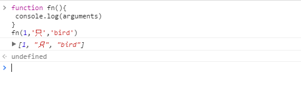

## 问答

---
### 1. 函数声明和函数表达式有什么区别 （*）
函数表达式只做了一个声明变量为函数的操作，只是变量提升；而函数声明则会使整个函数提升。

### 2. 什么是变量的声明前置？什么是函数的声明前置 （**）
前置就是提升到前面，变量声明前置就是把变量提升到前面，函数声明前置则把函数提升到前面。

### 3. arguments 是什么 （*）
arguments是取函数的实参组成一个数组，是函数的固有属性，如下示意：

  

### 4. 函数的重载怎样实现 （**）
* 同种函数拥有唯一的函数名与形参，相同名字的函数参数个数不同或者顺序不同都被认为是不同的函数，称为函数重载。
* JS并没有函数重载这个特性，因为只要函数名相同JS就认为是同一个函数。
* 然而我们可以通过判断传入参数的个数来简单的模拟函数重载,如下示意：

```javascript
function fn(){
        if(arguments.length == 1 ){
                return arguments[0];
}
        if(arguments.length == 2){
                return arguments[0]+arguments[1];
}
}
```


### 5. 立即执行函数表达式是什么？有什么作用 （*** ）
* 形如(function fn(){}())，因为如果直接写function fn(){}(),JS判断这个函数语法错误，所以在函数前面加个运算符或者外面加个括号避免JS用函数的语法解读。
* 作用就是可以立即执行函数，形成自己的封闭空间，防止内部参数与外部参数的相互污染，实现自我的私有封装。简而言之为即用即删。

### 6. 什么是函数的作用域链 （****）
* 只有函数才会涉及到作用域，而作用域链也是对其而言的。
* 作用域链
  当同一个闭包作用域下两个参数或者变量同名时，就会产生命名冲突。更近的作用域有更高的优先权，所以最近的优先级最高，最远的优先级最低。这就是**作用域链**。链的第一个元素就是最里面的作用域，最后一个元素便是最外层的作用域。
  作用域链这个命名已经很形象的表达了它包含的意义，有作用域的情况下，**按照就近原则来链接变量或者参数**。


## 代码

---
### 1. 以下代码输出什么？ （难度**）

```javascript
function getInfo(name, age, sex){
    console.log('name:',name);
    console.log('age:', age);
    console.log('sex:', sex);
    console.log(arguments);
    arguments[0] = 'valley';
    console.log('name', name);
}

getInfo('hunger', 28, '男');//name:hunger age:28 sex:男 ["hunger",8,"男"] name valley
getInfo('hunger', 28);//name:hunger age:28 sex:undefined ["hunger",28] name valley
getInfo('男');//name:男 age:undefined sex:undefined ["男"] name valley
```

### 2. 写一个函数，返回参数的平方和？如 （难度**）

```javascript
function sumOfSquares(){
    var sum = 0;
    for(var i = 0; i<arguments.length; i++){
        sum += Math.pow(arguments[i],2)
    }
    return console.log(sum);
}
sumOfSquares(2,3,4);   // 29
sumOfSquares(1,3);   // 10
```

### 3. 如下代码的输出？为什么 （难度*）

```javascript
console.log(a);
var a = 1;
console.log(b);
```
以上代码等价于
```javascript
var a
console.log(a);//输出 undefined
a = 1;
console.log(b);//输出 b is not defined
```


### 4. 如下代码的输出？为什么 （难度*）

```javascript
sayName('world');
sayAge(10);
function sayName(name){
    console.log('hello ', name);
}
var sayAge = function(age){
    console.log(age);
};
```
代码等价于：

```javascript
function sayName(name){
    console.log('hello ', name);
}
var sayAge;
sayName('world');//调用函数sayName，传入实参'world';输出 hello world
sayAge(10);//输出error:sayAge is not a function
sayAge = function(age){
    console.log(age);
};
//输出hello world
//   error:sayAge is not a function
```

### 5. 如下代码的输出？为什么 （难度**）

```javascript
 function fn(){}//声明函数fn
 var fn = 3;//声明变量fn(覆盖之前声明)，并赋值3
 console.log(fn);//输出3
 //输出3
```

### 6. 如下代码的输出？为什么 （难度***）

```javascript
function fn(fn2){
   console.log(fn2);
   var fn2 = 3;
   console.log(fn2);
   console.log(fn);
   function fn2(){
        console.log('fnnn2');
    }
 }
fn(10);
//输出 函数fn2 3 函数fn
```
代码等价于：

```javascript
function fn(fn2){
    var fn2;
    function fn2(){
        console.log('fnnn2');
    }
    console.log(fn2);//输出函数fn2
    fn2 = 3;//赋值fn2为3
    console.log(fn2);//输出3
    console.log(fn);//输出函数fn
}
//输出 函数fn2 3 函数fn
```

### 7. 如下代码的输出？为什么 （难度***）  

```javascript
var fn = 1;
function fn(fn){
     console.log(fn);
}
console.log(fn(fn));
//输出error:fn is not a function
```
插入监控代码如下：

```javascript
console.log(typeof fn)//输出function
var fn = 1;
console.log(typeof fn)//输出number
function fn(fn){
    console.log(fn);
}
console.log(typeof fn)//输出number
console.log(fn(fn));
//显然报错
```
其实原代码相当于：

```javascript
var fn;
function fn(fn){
    console.log(fn);
}
fn = 1;
console.log(fn(fn));
//显而易见会报错
```

### 8. 如下代码的输出？为什么 （难度**）

```javascript
//作用域
console.log(j);//输出j为undefined，由于变量声明提升
console.log(i);//输出i为undefined，由于变量声明提升
for(var i=0; i<10; i++){//for循环至i=10跳出循环（变量声明提升）
    var j = 100;//变量声明提升，并赋值j为100
}
console.log(i);//输出i，值为10
console.log(j);//输出j，值为100
//输出undefined undefined 10 100
```

### 9. 如下代码的输出？为什么 （难度****）

```javascript
fn();//执行函数fn
var i = 10;//覆盖i之前的赋值并赋值为10
var fn = 20;
console.log(i);//最后输出，输出为10
function fn(){
    console.log(i);//输出undefined，下行代码的变量声明提升的结果
    var i = 99;
    fn2();//执行函数fn2
    console.log(i);//输出100
    function fn2(){
        i = 100;//全局声明i赋值为100
    }
}
//输出undefined 100 10
```

### 10. 如下代码的输出？为什么 （难度*****）

```javascript
var say = 0;//声明一个变量say并赋值为0
(function say(n){//定义立即执行函数
    console.log(n);//打印n
    if(n<3) return;//n小于3时return跳出函数体，最后一次为2，先打印再跳出函数体。
    say(n-1);//每次n减1后再调用自己（递归）
}( 10 ));//实参为10
console.log(say);
//输出10 9 8 7 6 5 4 3 2 0
```


## 参考

---
[JS作用域与提升](http://www.cnblogs.com/betarabbit/archive/2012/01/28/2330446.html)

[JS作用域与作用域链](http://www.cnblogs.com/lhb25/archive/2011/09/06/javascript-scope-chain.html)

[[译]JavaScript:函数的作用域链](http://www.cnblogs.com/ziyunfei/archive/2012/11/17/2768967.html)

[函数](https://developer.mozilla.org/zh-CN/docs/Web/JavaScript/Guide/Functions)

---
**本文章著作权归九霄所有，转载须说明来源**
