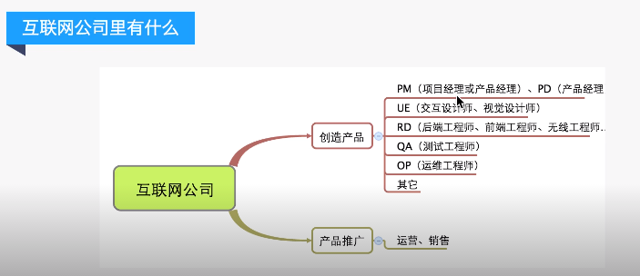
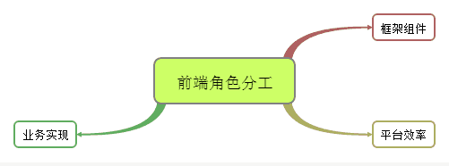
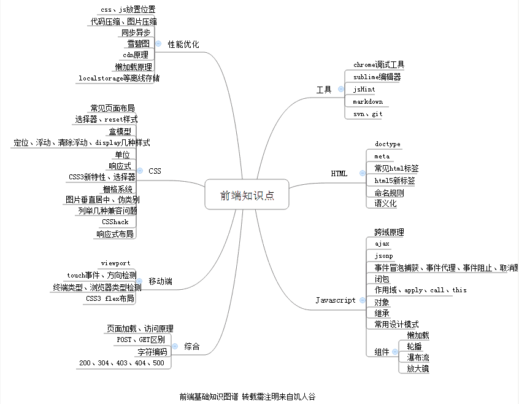

### 关键字

---
RD 前端知识点脑图 两个坎

### 知识点

---
1.互联网公司各个岗位职责与工作流程。

  

2.前端工程师分工。

  

3.前端工程师必备能力。

  

### 知识拓展

---
 1. <a href="http://www.jirengu.com/app/album/13">ps切图（小恶魔系列）</a>

### 业内词汇：

---
 1. **冒烟**：功能预演。
 2. 前后端交互*联词*。
 3. ** 代码格式化**：即按照**规范的格式**展示你写的代码。

### 两个坎：

---
 1. 学完html、css、js后能够自己从**无到有规范地**写代码。
 2. 学到一定程度以后，找出自己与大牛的差距。写写**jQuery**的**组件**和研究别人**框架**的代码，再自己尝试把工作中经常**重复使用**的东西写成**框架代码**和形成**库**。

---
**本文章著作权归九霄所有，转载须说明来源**

