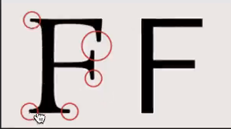

### 关键词

---
浏览器历史 浏览器内核 chrome功能 

### 知识点

---
#### 1.概览浏览器
* [浏览器市场份额](http://tongji.baidu.com/data/browser)

#### 2.浏览器与内核
* 壳（交互界面、shell）
  * 内核

|    浏览器    |     内核（排版引擎）     |             备注              |
| :-------: | :--------------: | :-------------------------: |
|    IE     |     Trident      |             闭源              |
|  Firefox  |      Gecko       | Netscape使用的Mozilla引擎，后被开源重写 |
|   Opera   | Presto -> WebKit |           曾经世界第二            |
|  Safari   |      WebKit      |         最早基于 KHTML          |
|  Chrome   | Webkit -> Blink  |            浏览器新秀            |
| Konqueror |      KHTML       |                             |

#### 3.chrome功能简介
* 在开发者工具下长按刷新有三个选项
    * 正常重新加载
    * 硬性重新加载`跳过缓存`
    * 清空缓存并硬性重新加载
* 刷新页面
    标签处圆圈先逆时针转动`向服务器发送请求`，再顺时针转动`服务器响应，下载内容`。
    * 隐私者模式
      可以排除一些缓存，cookie的问题。
    * 切换用户
      实现多开

​    

* 缩放功能
  在调试页面时重置为100%排除影响
  * **[第三方cookie](https://github.com/FrankFang/githublog/blob/master/%E6%8A%80%E6%9C%AF/%E7%AC%AC%E4%B8%89%E6%96%B9%20Cookie%20%E4%B8%8E%20%E3%80%8C%E8%AF%B7%E5%8B%BF%E8%B7%9F%E8%B8%AA%E3%80%8D%E2%80%94%E2%80%94%E5%B9%BF%E5%91%8A%E5%95%86%E3%80%81%E6%B5%8F%E8%A7%88%E5%99%A8%E4%B8%8E%E7%94%A8%E6%88%B7%E4%B9%8B%E9%97%B4%E7%9A%84%E5%8D%9A%E5%BC%88.md)**
  * 弹窗设置
    默认不允许弹窗
  * serif 和 sans serif

​    

* **前端开发者专用快捷键**
  F12—开发者工具  
  * **熟悉开发者工具**
    * 实验属性
      * workspace
        在开发者工具中调试代码时，可以**自动保存**代码，避免调试完再回到编辑器里改代码的二次操作，提高了工作效率。
    * 开发者工具搜索功能
      * 介绍一种搜索功能，可以用来搜索css、js、html等所有文件。
        打开开发者工具—>点击右上角的竖3个点处—>点选Search all files—>在搜索框输入内容回车即可（ps：点击 **{ }** 可以格式化代码）

### 拓展知识

---
1. [浏览器大战](https://zh.wikipedia.org/wiki/%E6%B5%8F%E8%A7%88%E5%99%A8%E5%A4%A7%E6%88%98)
2. 百度统计不到360浏览器的缘由
* 360推出搜索引擎抢占百度客户
* 百度屏蔽360
* 360userAgent伪装成普通浏览器
3. [《Code Rush》（奔腾的代码）](http://www.tudou.com/programs/view/eTSD_kr89wg)- Firefox 开源的过程记录
4. [《记心目中的女神》](http://www.jianshu.com/p/0cf2f2dd66bd)- Opera
5. [传奇字体Helvetica纪录片](http://v.youku.com/v_show/id_XMzg4NDUzMDUy.html?from=s1.8-1-1.2&spm=0.0.0.0.Bogyvr)

---
**本文章著作权归九霄所有，转载须说明来源**
