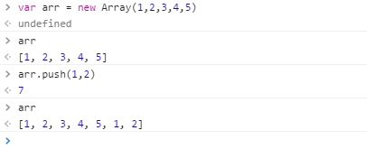
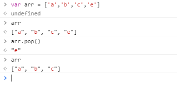
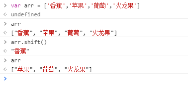
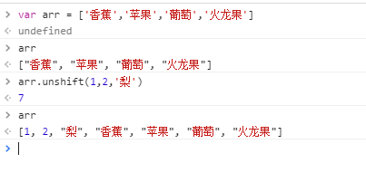
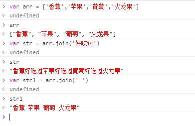
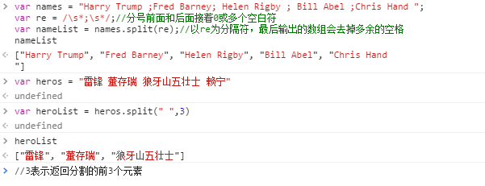

## 问答

---
### 1. 数组方法里push、pop、shift、unshift、join、split分别是什么作用。（*）
* push
  push() 方法添加一个或多个元素到数组的末尾，并返回数组新的长度（length 属性值）。
  * 语法
>arr.push(element1, ..., elementN)

* 示例
    

* pop
  pop() 方法删除一个数组中的最后的一个元素，并且返回这个元素。
  * 语法
>array.pop()


*   示例
    

*  shift
   shift() 方法删除数组的 第一个 元素，并返回这个元素。该方法会改变数组的长度。
   * 语法

     > arr.shift()

   * 示例

   


*  unshift
   unshift() 方法在数组的开头添加一个或者多个元素，并返回数组新的 length 值。
   * 语法

     > arr.unshift(element1, ..., elementN)

   * 示例

     

   ​

*  join
   join() 方法将数组中的所有元素连接成一个字符串。
   * 语法

     > str = arr.join([separator = ','])

      separator 可选，用于指定连接每个数组元素的分隔符。分隔符会被转成字符串类型；如果省略的话，默认为一个逗号。如果 seprator 是一个空字符串，那么数组中的所有元素将被直接连接。

   * 示例

   

*  split
   split() 方法通过把字符串分割成子字符串来把一个 String 对象分割成一个字符串数组。
   split 方法返回一个数组。
   * 语法

     > str.split([separator][, limit])

      separator 指定用来分割字符串的字符（串）。separator 可以是一个字符串或正则表达式。 如果忽略 separator，则返回整个字符串的数组形式。如果 separator 是一个空字符串，则 str 将会把原字符串中每个字符的数组形式返回。

     limit 一个整数，限定返回的分割片段数量。split 方法仍然分割每一个匹配的 separator，但是返回的数组只会截取最多 limit 个元素。

   * 示例

     

   ​


## 代码

---
### 数组
#### 1. 用 splice 实现 push、pop、shift、unshift方法 （***）
* splice
  splice() 方法用新元素替换旧元素，以此修改数组的内容。
  * 语法
>array.splice(start, deleteCount[, item1[, item2[, ...]]])

     start​
从数组的哪一位开始修改内容。如果超出了数组的长度，则从数组末尾开始添加内容；如果是负值，则表示从数组末位开始的第几位。
deleteCount
整数，表示要移除的数组元素的个数。如果 deleteCount 是 0，则不移除元素。这种情况下，至少应添加一个新元素。如果 deleteCount 大于start 之后的元素的总数，则从 start 后面的元素都将被删除（含第 start 位）。
itemN
要添加进数组的元素。如果不指定，则 splice() 只删除数组元素。

```javascript
  function push(arr,value){
    arr.splice(arr.length,0,value)
    return arr.length
  }
  function pop(arr){
    return arr.splice(-1,1)    
  }
  function shift(arr){
    return arr.splice(0,1)
  }
  function unshift(arr,value){
    arr.splice(0,0,value)
    return arr.length
  }

```

#### 2. 使用数组拼接出如下字符串 （*** ）
```javascript
  var prod = {
    name: '女装',
    styles: ['短款', '冬季', '春装']
  };
  function getTplStr(data){
    var Str = '<dl class="product">\n'
    Str += '\u0020\u0020\u0020\u0020'+'<dt>' + data.name + '</dt>\n'
    for(i = 0; i<data.styles.length; i++){
      Str += '\u0020\u0020\u0020\u0020'+'<dd>' + data.styles[i] + '</dd>\n'
    }
    Str += '</dl>'
    return Str
  };
  var result = getTplStr(prod); 
```
```javascript
<dl class="product">
    <dt>女装</dt>
    <dd>短款</dd>
    <dd>冬季</dd>
    <dd>春装</dd>
</dl>
```

#### 3. 写一个find函数，实现下面的功能 （*** ）
```javascript
  function find(arr,value){
    var arrIndexOf = arr.indexOf(value)
    return console.log(arrIndexOf)
  }
  var arr = [ "test", 2, 1.5, false ]
  find(arr, "test") // 0
  find(arr, 2) // 1
  find(arr, 0) // -1
```

#### 4. 写一个函数filterNumeric，把数组 arr 中的数字过滤出来赋值给新数组newarr， 原数组arr不变 （****）
```javascript
  function filterNumeric(arr){
    var newArr = []
    for(var i = 0; i<arr.length; i++){
      if(typeof arr[i] === 'number' ){
        newArr.push(arr[i])
      }else{
        continue
      }
    }
    return console.log(newArr)
  }
  arr = ["a", "b", 1, 3, 5, "b", 2];
  newarr = filterNumeric(arr);  //   [1,3,5,2]
```

#### 5. 对象obj有个className属性，里面的值为的是空格分割的字符串(和html元素的class特性类似)，写addClass、removeClass函数，有如下功能：(****)
```javascript
    function addClass(obj,value){
    var toArr = obj.className.split(' ')
    if(toArr.indexOf(value) === -1){
        obj.className += ' '+value
    }
    return console.log(obj.className)
    }
    function removeClass(obj,value){
    var toArr = obj.className.split(' ')
    if(toArr.indexOf(value) != -1){
        toArr.splice(toArr.indexOf(value),1)
        obj.className = toArr.join(' ')
    }
    return console.log(obj.className)
    }
    var obj = {
    className: 'open menu'
    }
    addClass(obj, 'new') // obj.className='open menu new'
    addClass(obj, 'open')  // 因为open已经存在，所以不会再次添加open
    addClass(obj, 'me') // me不存在，所以 obj.className变为'open menu new me'
    console.log(obj.className)  // "open menu new me"

    removeClass(obj, 'open') // 去掉obj.className里面的 open，变成'menu new me'
    removeClass(obj, 'blabla')  // 因为blabla不存在，所以此操作无任何影响
```

#### 6. 写一个camelize函数，把my-short-string形式的字符串转化成myShortString形式的字符串，如 (*** )
```javascript
	function camelize(str){
		var toArr = str.split('-')
		if(toArr.length === 1){return str}
		for( i = 1; i<toArr.length; i++){
			toArr[i] = toArr[i].substr(0,1).toUpperCase() + toArr[i].substr(1)
		}
		return toArr.join('')
	}
	console.log(camelize("background-color") == 'backgroundColor')
	console.log(camelize("list-style-image") == 'listStyleImage')
```

#### 7. 如下代码输出什么？为什么? (*** )
```javascript
arr = ["a", "b"];
arr.push( function() { alert(console.log('hello hunger valley')) } );//数列arr从后面添加一个函数元素
arr[arr.length-1]()  // 调用函数，console.log输出hello hunger valley同时返回值undefined；故弹窗为undefined
 // 弹窗undefined,同时控制台输出hello hunger valley
```

#### 8. 写一个函数filterNumericInPlace，过滤数组中的数字，删除非数字。要求在原数组上操作 (****)
```javascript
	function filterNumericInPlace(arr){
		for(var i = arr.length-1; i >= 0; i--){
			if(typeof arr[i] != 'number' ){
				arr.splice(i,1)
			}
		}
	}
	arr = ["a", "b", 1, 3, 4, 5, "b", 2];
	//对原数组进行操作，不需要返回值
	filterNumericInPlace(arr);
	console.log(arr)  // [1,3,4,5,2]
```

#### 9. 写一个ageSort函数实现数组中对象按age从小到大排序 （*** ）
```javascript
	function ageSort(arr){
		arr.sort(function(p1,p2){
			return p1.age - p2.age
		})
	}
	var john = { name: "John Smith", age: 23 }
	var mary = { name: "Mary Key", age: 18 }
	var bob = { name: "Bob-small", age: 6 }
	var people = [ john, mary, bob ]
	ageSort(people) // [ bob, mary, john ]
```

#### 10. 写一个filter(arr, func) 函数用于过滤数组，接受两个参数，第一个是要处理的数组，第二个参数是回调函数(回调函数遍历接受每一个数组元素，当函数返回true时保留该元素，否则删除该元素)。实现如下功能： （****）
```javascript
	function filter(arr,func){
		for(var i = arr.length-1; i>= 0; i--){
			if(!func(arr[i])){
				arr.splice(i,1)
			}
		}
		return arr
	}
	function isNumeric (el){
    return typeof el === 'number'; 
	}
	arr = ["a",3,4,true, -1, 2, "b"]

	arr = filter(arr, isNumeric) ; // arr = [3,4,-1, 2],  过滤出数字
	arr = filter(arr, function(val) { return  typeof val === "number" && val > 0 });  // arr = [3,4,2] 过滤出大于0的整数
```


### 字符串
### 1. 写一个 ucFirst函数，返回第一个字母为大写的字符 （*** ）
```javascript
	function ucFirst(str){
		var newStr = str.substr(0,1).toUpperCase() + str.substr(1)
		return newStr
	}
	ucFirst("hunger") == "Hunger"
```
### 2. 写一个函数truncate(str, maxlength), 如果str的长度大于maxlength，会把str截断到maxlength长，并加上...，如 （****）
```javascript
	function truncate(str,maxlength){
		var newStr = str
		if(str.length > maxlength){
			newStr = str.substr(0,maxlength) + '...'
		}
		return newStr
	}
	truncate("hello, this is hunger valley,", 10) == "hello, thi...";
	truncate("hello world", 20) == "hello world"
```


### 数学函数
### 1. 写一个函数，获取从min到max之间的随机整数，包括min不包括max （*** ）

```javascript
	function randomInt(min,max){
		var float = Math.random()*(max-min)+min
		return parseInt(float)
	}

```

### 2. 写一个函数，获取从min到max之间的随机整数，包括min包括max （*** ）

```javascript
	function randomInt(min,max){
	var float = Math.random()*(max+1-min)+min
	return Math.floor(float)
	}
```

### 3. 写一个函数，获取一个随机数组，数组中元素长度为len，最小值为min，最大值为max(包括)的随机整数 （*** ）

```javascript
	function generateArr(max,min,len){
		var arr = []
		for(var i = 0; i<len; i++){
			arr.push(Math.floor(Math.random()*(max+1-min)+min))
		}
		return arr
	}
```

### 4. 写一个函数，生成一个长度为 n 的随机字符串，字符串字符的取值范围包括0到9，a到 z，A到Z。

```javascript
	function getRandStr(len){
		var str = '',
		num = 0,
		SOS = '0123456789abcdefghijklmnopqrstuvwxyzABCDEFGHIJKLMNOPQRSTUVWXYZ';
		for(i = 0; i<len ; i++){
			num = Math.floor(Math.random()*(SOS.length))
			str += SOS.substr(num,1)
		}
		return str
	}
	var str = getRandStr(10); // 0a3iJiRZap
```


## 参考

---
[split()](https://developer.mozilla.org/zh-CN/docs/Web/JavaScript/Reference/Global_Objects/String/split)

---
**本文章著作权归九霄所有，转载须说明来源**
