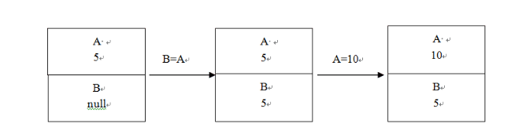
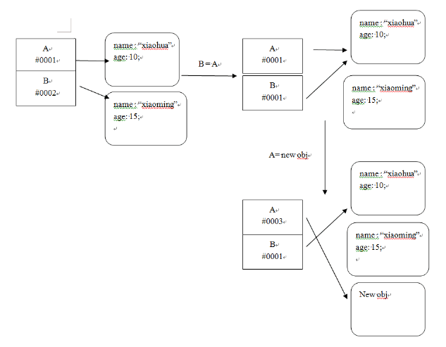
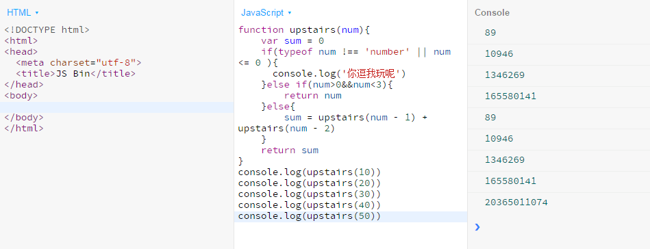

## 问答

---
### 1. 基础类型有哪些？复杂类型有哪些？有什么特征？
*  基础类型
   包括：字符串（string）、数值（number）、布尔值（boolean）、NaN、undefined、null。
   特征：基础类型将内容直接存储在栈中，记录的是该数据类型的值，直接访问即可。
   如下图示意：

   


*  复杂类型
   包括：对象，广义的对象包含3种子类型分别为狭义对象（object）、数列（array）、函数（function）。
   特征：复杂类型将内容存储在堆中，栈中记录的是指针（堆的地址），外部访问时先引出地址，再通过地址去找到值所存放的位置。
   如下图示意（地址为假设值）：

   

   ​

### 2. 如下代码的输出? 为什么?

```javascript
var obj1 = {a:1, b:2};
var obj2 = {a:1, b:2};
console.log(obj1 == obj2);//false，指向不同的地址，对象不同（详见上题）
console.log(obj1 = obj2);//{a:1, b:2}，赋值表达式，把obj2的地址赋给obj1，指向同一个堆
console.log(obj1 == obj2);//true，指向同一个对象
```

## 代码

---
### 1. 写一个函数getIntv，获取从当前时间到指定日期的间隔时间

```javascript
// 1. 写一个函数getIntv，获取从当前时间到指定日期的间隔时间
function getIntv(anytime){
	var now = new Date()
	var then = new Date(anytime)
	// var thenArr = anytime.split('-')
	// if(parseInt(thenArr[1]) > 12 ||parseInt(thenArr[1]) < 1 || parseInt(thenArr[0]) < 1 || parseInt(thenArr[2]) < 1 || parseInt(thenArr[2]) > 31){
	// 	return alert('你逗我玩啊，请按照要求输入正确的年月日')
	// }
	// var MTD = 0
	// for(i = 1; i <= (thenArr[1]-0); i++){
	// 	if(i === 4 ||i === 6 ||i === 9 ||i === 11){
	// 		var DOM = 30 
	// 	}else if(i === 2){
	// 		var DOM = 28
	// 	}else{
	// 		var DOM = 31
	// 	}		
	// 	MTD += DOM
	// }
	// var then = (thenArr[0]-1970)*365*24*3600 + (MTD-31)*24*3600 + (thenArr[2]-1)*24*3600
	// var TD = then - now/1000 
	// 少了12天左右，由于闰年2月多1天没算进去…………
	var TD = (then - now)/1000
	var days = parseInt(TD/3600/24)
	var hours = parseInt(TD/3600%24)
	var minutes = parseInt(TD/60%60)
	var seconds = parseInt(TD%60)
	return '距' + anytime + '还有' + days + '天' + hours + '小时' + minutes + '分' + seconds + '秒'
}
alert('请以 "2016/10/08[/22:30:00]" 形式获取准确时间(注：[]里的内容表示可以省略)')
var str = getIntv("2017/01/01");
console.log(str);  // 距除夕还有 20 天 15 小时 20 分 10 秒	

```

### 2. 把数字日期改成中文日期

```javascript
function getChsDate(numDate){
	// var dateArr = numDate.split('-'),
	var t = new Date(numDate)
	var year = t.getFullYear()
	var month = t.getMonth() + 1
	var date = t.getDate()
	chsNum = '零一二三四五六七八九十'

	// if(dateArr[1].substr(0,1) === '0'){
	// 	var month = dateArr[1].slice(1)
	// }else{var month = dateArr[1]}
	// if(dateArr[2].substr(0,1) === '0'){
	// 	var date = dateArr[2].slice(1)
	// }else{var date = dateArr[2]}

	function yearNum(num){
		var num = '' + parseInt(num)
		var CNum = num.split('')
		for(var i = 0; i<CNum.length; i++){
			CNum[i] = chsNum[parseInt(CNum[i])]
		}
		return CNum.join('')
	}

	function monthNum(num){
		var num = '' + parseInt(num)
		var newNum = num.split('')
		newNum[1] = chsNum[parseInt(newNum[1])]
		if(parseInt(num) > 0&&parseInt(num) < 10){
			return yearNum(num)
		}
		if(parseInt(num) > 9&&parseInt(num) < 13){
			newNum[0] = '十'
			return newNum.join('')
		}
		// return '"亲，你在逗我玩吗？请输入正确月份"'
	}
	function dateNum(num){
		var num = '' + parseInt(num)
		var newNum = num.split('')
		newNum[1] = chsNum[parseInt(newNum[1])]
		if(parseInt(num) > 0&&parseInt(num) < 10){
			return yearNum(num)
		}		
		if(parseInt(num) > 9&&parseInt(num) < 32){
			newNum[0] = chsNum[parseInt(newNum[0])] + '十'
			return newNum.join('')
		}
		// return '"亲，你在逗我玩吗？请输入正确日期"'
	}
	return yearNum(year) + '年' + monthNum(month) + '月' + dateNum(date) + '日'
	// return yearNum(dateArr[0]) + '年' + monthNum(dateArr[1]) + '月' + dateNum(dateArr[2]) + '日'

}

var str = getChsDate('2015-01-18');
console.log(str);  // 二零一五年一月八日
var str1 = getChsDate('2015-11-28');
console.log(str1); 
var str2 = getChsDate('2015-01-35');
console.log(str2); 
```

### 3. 写一个函数获取n天前的日期

```javascript
function getLastNDays(n){
	var now = new Date()
	var then =new Date(now-(n*24*3600*1000))
	var year = then.getFullYear()
	var month = then.getMonth() + 1
	var date = then.getDate()
	return year + '-' + month + '-' + date
	
}
var lastWeek =  getLastNDays(7); 
var lastMonth = getLastNDays(30); 
```

### 4. 完善如下代码，用于获取执行时间如：

```javascript
var Runtime = (function(){
    var startTime, endTime, gTime
    var obj = {
        start: function(){
            startTime = new Date().getTime()
        	
        },
        end: function(){
            endTime = new Date().getTime()
        },
        get: function(){
            gTime = endTime - startTime
            return gTime + 'ms'
        }
    };
	return obj;
}());
Runtime.start();

for(var i = 0;i<1000;i++){
	console.log("1");
}

Runtime.end();
console.log(  Runtime.get() );

```

### 5. 楼梯有200级，每次走1级或是2级，从底走到顶一共有多少种走法？用代码（递归）实现

```javascript
function upstairs(num){
    var sum = 0
    if(typeof num !== 'number' || num <= 0 ){
        return console.log('你逗我玩呢')
    }
    else if(num>0&&num<3){
	    return num
    }
    else{
        sum = upstairs(num - 1) + upstairs(num - 2)
    }
	return sum
}
console.log(upstairs(10))
console.log(upstairs(200))
```

当数量到一个临界值时，由于空间复杂度太大就会卡死。
num=40还能输出，num=50就开始卡一段时间才能出结果了，具体临界值是多少就不试了。如下图：


### 6. 写一个json对象深拷贝的方法，json对象可以多层嵌套，值可以是字符串、数字、布尔、json对象中的任意项

```javascript
function jsonCopy(json){
	var newJson = {}
	for(var key in json){
		if(json[key] === 'object'){
			newJson[key] = jsonCopy(json[key])
		}else{
			newJson[key] = json[key]
		}
	}
	return newJson
}
```


## 参考

---
[递归](http://zisong.me/post/suan-fa/ren-nao-li-jie-di-gui)

[JSON](http://book.jirengu.com/fe/%E5%89%8D%E7%AB%AF%E5%9F%BA%E7%A1%80/Javascript/json.html)


---
**本文章著作权归九霄所有，转载须说明来源**
