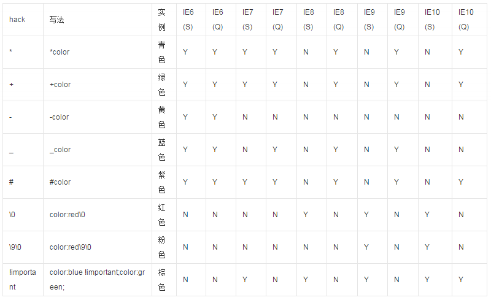
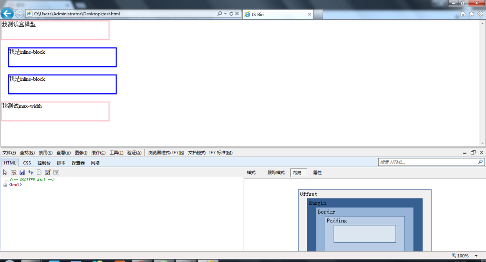
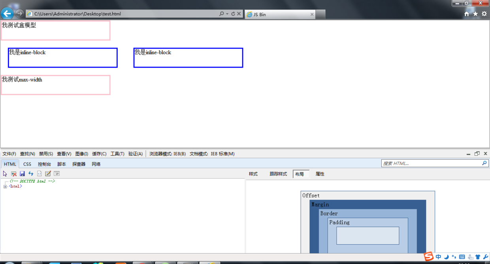

## 问答

---
### 1. 如何调试 IE 浏览器
* IE7及以上版本
  使用开发者工具调试。
* IE6
  使用border、JS配合控制台调试。

### 2. 什么是CSS hack？在 CSS 和 HTML里如何写 hack？在 CSS 中 IE 7、IE 8的 hack 方式？
* CSS hack
  是指为了兼容不同浏览器或者同种浏览器不同版本渲染成同样效果的页面而分别写不同的CSS。
* CSS和HTML里如何写hack( CSS中IE7、IE8的Hack方式)
  CSS Hack大致有3中方式：
   a. HTML头部引用(if IE)Hack——**条件注释法**  

    ```
        * 只在IE下生效
        <!--[if IE]>
        代码
        <![endif]-->
        * 只在IE6下生效
        <!--[if IE 6]>
        代码
        <![endif]-->
        * 只在IE6以上版本生效
        <!--[if gte IE 6]>
        代码
        <![endif]-->
        * 只在IE8上不生效
        <!--[if ! IE 8]>
        代码
        <![endif]-->
        * 非IE浏览器生效
        <!--[if !IE]>
        代码
        <![endif]-->
    ```

 b. CSS样式里写——**类内属性前缀法**
    属性前缀法是在CSS样式属性名前加上一些只有特定浏览器才能识别的Hack前缀，以达到预期的页面展现效果。
    IE浏览器各版本CSS Hack对照表：

  

```
    注：S——标准模式，Q——怪异模式

    在标准模式中：
    "-"减号是IE6专有的hack
    "\9"IE6/IE7/IE8/IE9/IE10都生效
    "\0"IE8/IE9/IE10都生效，是IE8/9/10的hack
    "\9\0"只对IE9/IE10生效，是IE9/10的hack
```

  c. CSS **选择器前缀法**
    选择器前缀法是针对一些页面表现不一致或者需要特殊对待的浏览器，在CSS选择器前加上一些只有某些特定浏览器才能识别的前缀进行hack。最常见如下：


    *html *前缀只对IE6生效
    *+html *+前缀只对IE7生效
    @media screen\9{...}只对IE6/7生效
    @media \0screen {body { background: red; }}只对IE8有效
    @media \0screen\,screen\9{body { background: blue; }}只对IE6/7/8有效
    @media screen\0 {body { background: green; }} 只对IE8/9/10有效
    @media screen and (min-width:0\0) {body { background: gray; }} 只对IE9/10有效
    @media screen and (-ms-high-contrast: active), (-ms-high-contrast: none) {body { background: orange; }} 只对IE10有效
    等等

* 在 CSS 中 IE 7、IE 8的 hack 方式
    * IE7 Hack
      `*` 、 `+` 、 `#` 、`\9`，详见IE Browser CSS Hack对照表
    * IE8 Hack
      `\0` 、 `\9`，详见IE Browser CSS Hack对照表

### 3. 列举几种 浏览器兼容问题
* IE6无法识别小于19px的小图标。
* 每种浏览器默认边距样式都不一样，一般会重置外边距与内边距为零。
* IE6 7 8不兼容大部分CSS3属性，如background-size。

### 4. 针对兼容、多浏览器覆盖有什么看法？渐进增强和优雅降级是什么意思？
* 针对兼容、多浏览器覆盖有什么看法
    * 原则：成本与收益。
    * 根据浏览器市场占有率，兼容主流、淘汰末流。
    * 对于高级浏览器功能全开，提供最好的用户体验。对于低级浏览器页面展示效果可以降低标准，并建议提醒客户转至高级浏览器享受更好用户体验。
* 渐进增强和优雅降级
    * 渐进增强（progressive enhancement）
      先把网页依低级浏览器实现最基本的功能，再根据需求一步一步的追加。是一种向前看的角度。
    * 优雅降级（graceful degratation）
      先按照最高要求实现功能，再降级兼容低级浏览器。是一种往回看的角度。

### 5. reset.css和normalize.css分别是做什么的？为什么推荐使用 nomalize.css?
* reset.css和normalize.css分别是做什么的
    * reset.css
      不同浏览器自带默认样式，而且各有不同，所以解决的方法就是一开始就将浏览器的默认样式全部去掉，更准确说就是通过重新定义标签样式。“覆盖”浏览器的CSS默认属性。最最简单的说法就是把浏览器提供的默认样式覆盖掉！这就是CSS reset。
    * normalize.css
      Normalize.css是一种CSS reset的替代方案，它：
      * 保护有用的浏览器默认样式而不是完全去掉它们
        * 一般化的样式：为大部分HTML元素提供
        * 修复浏览器自身的bug并保证各浏览器的一致性
        * 优化CSS可用性：用一些小技巧
        * 解释代码：用注释和详细的文档来
* 为什么推荐使用 nomalize.css
    * Normalize.css 保护了有价值的默认值
    * Normalize.css 修复了浏览器的bug
    * Normalize.css 不会让你的调试工具变的杂乱
    * Normalize.css 是模块化的
    * Normalize.css 拥有详细的文档

### 6. IE盒模型和标准盒模型有什么区别? 怎样使 IE7、8使用标准盒模型?box-sizing:border-box有什么作用
* IE盒模型和标准盒模型有什么区别
  在盒模型那个章节有详细提到过，主要区别在于IE的宽高包括了内容宽高、内边距和边框，而标准盒模型宽度只是内容宽度。
* 怎样使 IE7、8使用标准盒模型
  添加文档声明`<!doctype html>`。
* box-sizing:border-box有什么作用
  设置盒子的宽高为内容宽高、内边距、边框之和。
  除了IE6、7，主流浏览器基本都兼容。

## 操作

---
### 1. virtualbox 安装 xp 虚拟机

  

### 2. 在 IE 7、8 中展示 盒模型、inline-block、max-width的区别

  

  

## 参考

---
[知乎：怎样可以很好地保证网页的浏览器兼容性](https://www.zhihu.com/question/19736007)

[让我们谈一谈 Normalize.css](http://jerryzou.com/posts/aboutNormalizeCss/)

[知乎: Normalize.css 与传统的 CSS Reset 有哪些区别](https://www.zhihu.com/question/20094066)

[史上最全的CSS hack方式一览](http://blog.csdn.net/freshlover/article/details/12132801#t5)

[CSS Hack](http://baike.baidu.com/view/1119452.htm#3_1)

---
**本文章著作权归九霄所有，转载须说明来源**
