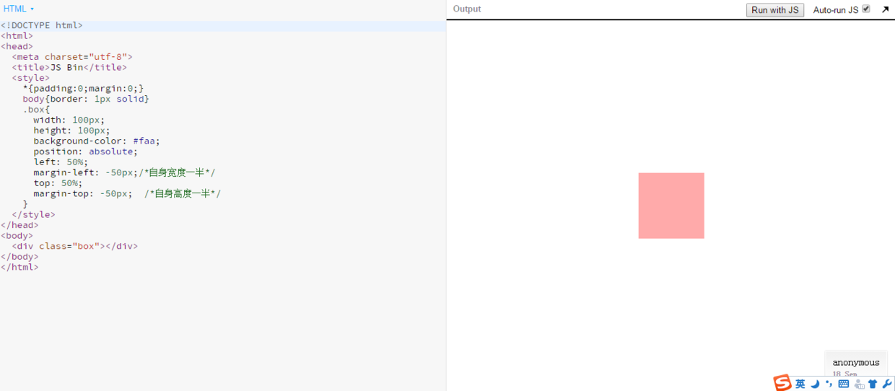

## 问答

---
### 1. 文档流的概念指什么？有哪种方式可以让元素脱离文档流?
文档流（normal flow）指按照从左到右、从上到下的布局方式，又称普通流、正常流、标准文档流。
让元素脱离文档流的方式有：
* float——浮动
```
float: left;
或
float: right;
```
浮动的元素脱离文档流，向左或者向右移动至包含块内边缘或者同样浮动的元素外边缘。
* position——定位
    * 绝对定位
```
position: absolute;
```
绝对定位的元素脱离文档流，在原位置上方直至设置了定位值，以最近已定位的祖先元素内边框为参照。
    * 固定定位
```
position: fixed;
```
固定定位的元素脱离文档流，在原位置上方直至设置了定位值，参照物为浏览器可视区。

### 2. 有几种定位方式，分别是如何实现定位的，使用场景如何？
css的定位机制分为三种：文档流、浮动、定位。
* 文档流
  文档流是所有元素布局的基础，作为从左到右、从上到下的布局方式，这是最常用的一种排版布局方式。
* 浮动
  实现语法和特性见题1，浮动最初是为了**实现文字环绕图片**，后来慢慢用于实现多列布局。
* 定位
  如下表：

|  定位  |   属性值    |            描述             |        适用范围         |
| :--: | :------: | :-----------------------: | :-----------------: |
| 静态定位 |  static  |          与文档流类似           |         默认          |
| 相对定位 | relative | 未脱离文档流，相对原来的位置定位，仍然占据原来位置 |       适用于层叠效果       |
| 绝对定位 | absolute |           脱离文档流           |     小区块的布局使用频繁      |
| 固定定位 |  fixed   |           脱离文档流           | 用于广告等意图一直出现在用户眼前的信息 |

### 3. absolute, relative, fixed 偏移的参考点分别是什么
如下表：

|  定位属性值   |        参考点         |
| :------: | :----------------: |
| absolute | 参考点为最近已定位的祖先元素的内边框 |
| relative |      参考点为内边框       |
|  fixed   |   参考点为浏览器可视区内边框    |

### 4. z-index 有什么作用? 如何使用?
z-index定义了z方向（与显示屏垂直的方向，值越大者堆叠显示在前面）的级别从而使元素有序堆叠显示。
ps:**该属性值只对已定位的元素有效**。
* 堆叠顺序
    * 不对元素设position时，文档流后面的元素覆盖前面的元素。
    * 将元素设置的position设置为relative ，absolute 或者 fixed，元素会覆盖没有设置 position 属性或者属性值为 static 的元素。
    * 一般情况下z-index值越大者在前面。
    * **子元素继承元素的堆叠关系**，不论子元素的z-index值比父元素的兄弟元素大或者小，都继承父元素与其兄弟元素的堆叠关系。

### 5. position:relative和负margin都可以使元素位置发生偏移?二者有什么区别
position:relative不论偏移到何处只是占据原来的位置，而margin比较霸道——偏移的位置都要被自己占据。
### 6. 如何让一个固定宽高的元素在页面上垂直水平居中?
如下：

  

[垂直水平居中](http://js.jirengu.com/vocuqotomi/1/edit?html,output)
### 7. 浮动元素有什么特征？对其他浮动元素、普通元素、文字分别有什么影响?
* 浮动元素特征：
    * 文字环绕图片。
    * 脱离文档流、不占位置。
    * 浮动的元素，一定程度上可以理解为带方向的inline-block元素，一样可以同行排列，可以设置元素宽高、边距，只是排列顺序可以从右到左。
* 浮动的影响：
    * 对其他浮动元素
      兄弟之间从左到右，从上到下排列。
    * 对普通元素
      脱离文档流，不占位置。
    * 对文字
      浮动创造的目的就是为了文字环绕图片，所以文字会环绕、包裹浮动元素。

### 8. 清除浮动指什么? 如何清除浮动?
* 清除浮动
  清除浮动指的是清除浮动对其他元素造成的影响。
* 如何清除浮动
  清除浮动的方法有很多，概括如下：
  *   运用clear:both/left/right清除浮动
    可以在浮动元素末尾添加一个空内容带clear样式属性的标签，最常用、最有的方式是添加一个带clear的伪元素，如下代码：

    ```
    .clearfix:after{
        content: "";
        display: block;
        clear: both;
    }
    .clear{*zoom: 1;}  /*兼容IE6*/
    ```

    * 触发BFC清除浮动
      触发BFC的方式有很多，如下：
      * 清除子元素浮动，父元素也浮动或者绝对定位触发BFC。
        * overflow属性值非visiable。
        * display成非块级盒子。
## 代码

---
[task10-1](https://github.com/jirengu-inc/jrg-renwu7/blob/master/members/%E8%B5%96%E9%9C%84/task-10/task10-1again.html)
[task10-1 preview](http://book.jirengu.com/jirengu-inc/jrg-renwu7/members/%E8%B5%96%E9%9C%84/task-10/task10-1again.html)

[task10-2](https://github.com/jirengu-inc/jrg-renwu7/blob/master/members/%E8%B5%96%E9%9C%84/task-10/task10-2.html)
[task10-2 preview](http://book.jirengu.com/jirengu-inc/jrg-renwu7/members/%E8%B5%96%E9%9C%84/task-10/task10-2.html)

## 参考

---
[z-index详解](http://www.cnblogs.com/ForEvErNoME/p/3373641.html)

[CSS float浮动的深入研究、详解及拓展(一)](http://www.zhangxinxu.com/wordpress/2010/01/css-float%E6%B5%AE%E5%8A%A8%E7%9A%84%E6%B7%B1%E5%85%A5%E7%A0%94%E7%A9%B6%E3%80%81%E8%AF%A6%E8%A7%A3%E5%8F%8A%E6%8B%93%E5%B1%95%E4%B8%80/)

[CSS float浮动的深入研究、详解及拓展(二)](http://www.zhangxinxu.com/wordpress/2010/01/css-float%E6%B5%AE%E5%8A%A8%E7%9A%84%E6%B7%B1%E5%85%A5%E7%A0%94%E7%A9%B6%E3%80%81%E8%AF%A6%E8%A7%A3%E5%8F%8A%E6%8B%93%E5%B1%95%E4%BA%8C/)

[盒模型Block box与Line box](https://segmentfault.com/a/1190000005155084#articleHeader8)

[浮动从何而来 我们为何要清除浮动 清除浮动的原理是什么](http://www.jb51.net/css/67471.html)

---
**本文章著作权归九霄所有，转载须说明来源**
