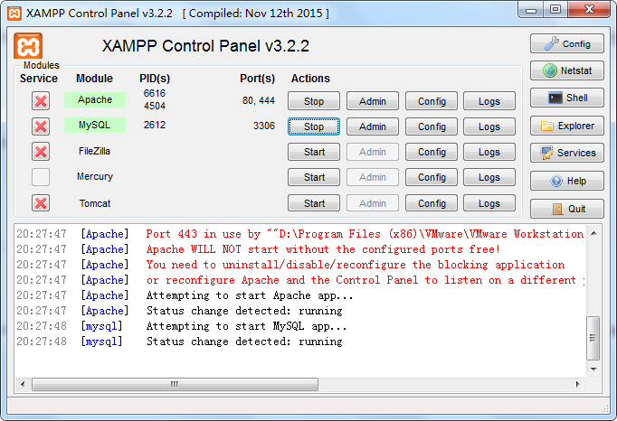
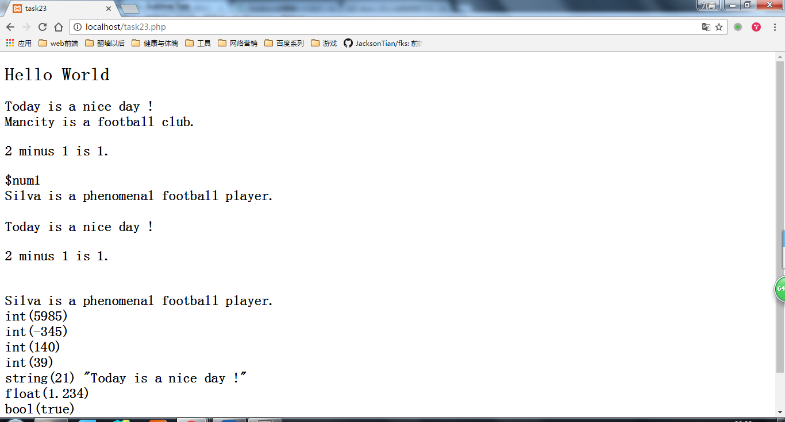
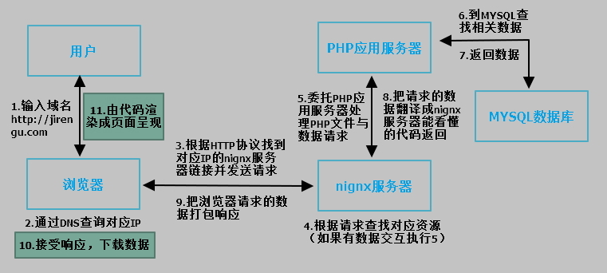

## 动手

---
### 1. 初学者在本地安装 Apache 与 PHP。安装 xampp 套件即可。XAMPP 里面包含 Apache 和 PHP.windows 用户也可安装 WAMP，安装包体积会小一些。对于后端熟悉的同学可单独安装Apache 和 PHP。

### 2. 学习 xampp或者wamp 的简单配置使用，在本地启动 web 服务器，通过浏览器访问，通过浏览器打开本地 webserver 下的 php 文件，截图展示。

## 问答

---
### 1. 简单描述下web 服务器、PHP、数据库、浏览器是如何实现动态网站的?

* 第一步
  用户输入域名，浏览器通过DNS查找到域名对应的IP地址。
* 第二步
  通过HTTP协议浏览器根据IP地址用默认端口链接web服务器并发送（包含对PHP文件与数据库）请求。
* 第三步
  web服务器委托PHP应用服务器处理对PHP文件与数据库的请求，PHP应用服务器找到对应PHP文件，并通过PHP文件链接至对应的数据库获取数据；PHP应用服务器再把得到的PHP文件与数据翻译成HTML代码返回给web服务器。web服务器把返回的HTML代码与相关数据打包再响应给浏览器。
* 第四步
  浏览器接受响应，下载相关数据，把HTML代码渲染后生成页面呈现给用户。

### 2. 常见的 WEB 服务器有哪些？

常见的web服务器见下表

|  web服务器  |                    简介                    |
| :------: | :--------------------------------------: |
|  Apache  | Apache优势在开源代码开放，可以运行在几乎所有的Unix、Linux、Windows系统平台上；缺点在于消耗的内存也比其他的web服务器要高。 |
|  Nginx   | Nginx是一款面向性能设计的HTTP服务器，相较于Apache、lighttpd具有占有内存少，稳定性高等优势。 |
| Lighttpd | Lighttpd服务器其目标是提供一个专门针对高性能网站，安全、快速、兼容性好并且灵活的Web Server环境。它具有内存开销低、CPU占用率低、效能好，以及模块丰富等特点。 |
|  Tomcat  | Tomcat服务器是一个开放源代码、运行servlet和JSP Web应用软件的基于java的Web应用软件容器。 |
|   IIS    | IIS是一种web服务组件，其中包括Web服务器、FTp服务器、NNTP服务器和SMTP服务器，分别用于网页浏览、文件传输、新闻服务和邮件发送等方面，它使得在网络上发送信息成为一件很容易的事。但IIS只能运行在Windows平台、Linux/Unix平台上。 |

### 3. 打开浏览器，在地址栏输入 `http://jirengu.com` 页面展现了饥人谷官网的信息，整个过程发生了什么？（饥人谷官网后台语言 php,web服务器 nginx，数据库 mysql）

整个过程如下图：

## 参考

---
[从输入URL到页面加载完成的过程-DNS解析域名过程](https://my.oschina.net/xiaotian120/blog/268711?p=%7B%7BcurrentPage-1%7D%7D)

[以Apache服务器、php语言为例 详解动态网站的访问过程](http://www.chinaz.com/web/2013/0216/292366.shtml)

[服务器搭建、svn使用](http://kejian.jirengu.com/fe?q_l=%E8%AF%BE%E4%BB%B6&q_d=07-%E6%9C%8D%E5%8A%A1%E5%99%A8%E6%90%AD%E5%BB%BA%E3%80%81svn%E4%BD%BF%E7%94%A8)

---
**本文章著作权归九霄所有，转载须说明来源**

---
