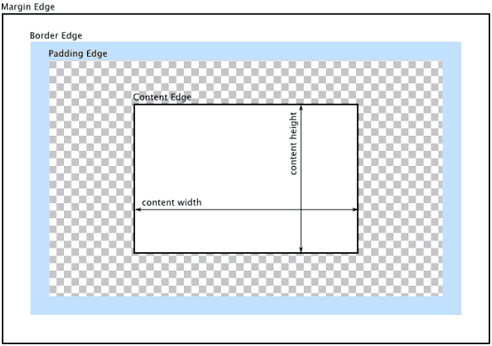
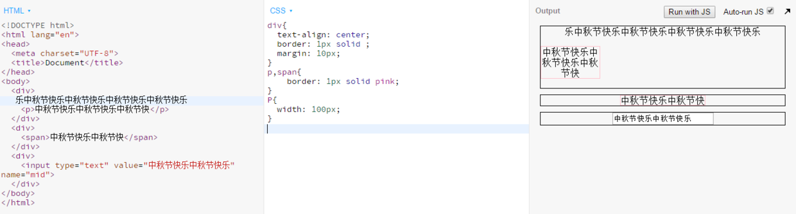
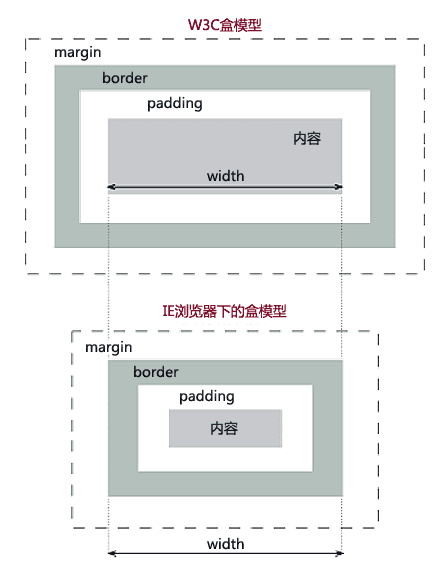
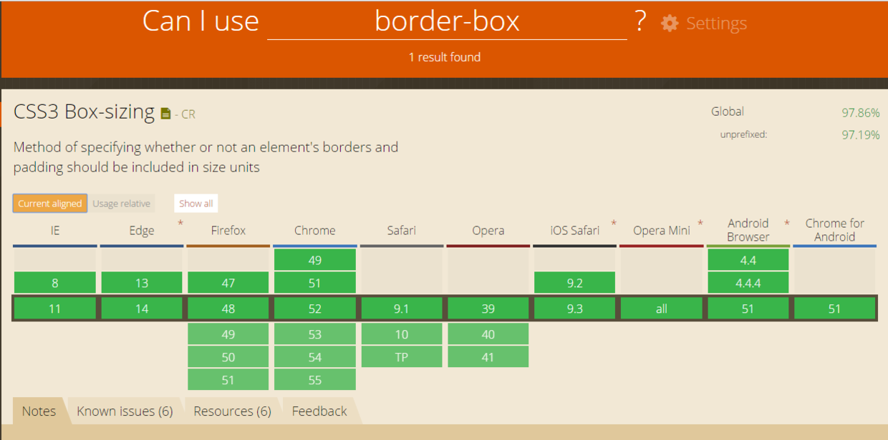
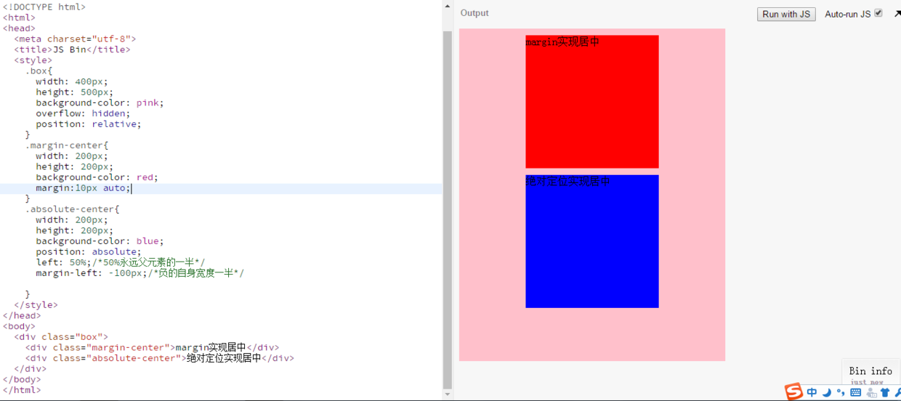
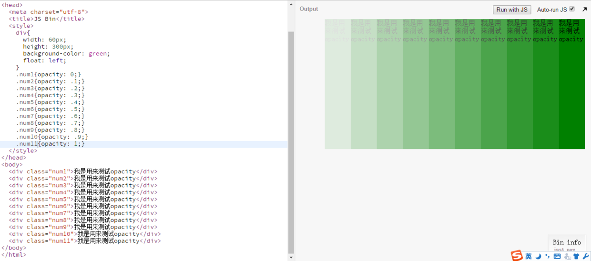
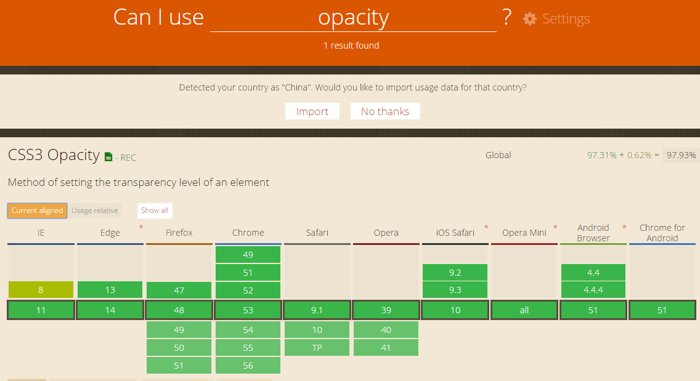

## 问答
---
### 1. 盒模型包括哪些属性
盒模型的属性包括**width**、**height**、**padding**、**margin**、**border**，如下图：

  

### 2. text-align: center的作用是什么，作用在什么元素上？能让什么元素水平居中
text-align:center规定**行内内容**相对父元素居中对齐，测试text-align: center在块级元素、行内元素、行内块元素的效果如下：

  

显然，所谓**行内内容**包括**行内元素**、**行内块元素**和**行内文本**。

### 3. 如果遇到一个属性想知道兼容性，在哪查看?
[点击查看兼容性](http://caniuse.com)

### 4. IE 盒模型和W3C盒模型有什么区别?
如下图：

  

区别在于width和height的算法不同，如下表：

|  盒模型   |          width算法          |          height算法          |
| :----: | :-----------------------: | :------------------------: |
| IE盒模型  | width=内容宽度+padding+border | height=内容高度+padding+border |
| W3C盒模型 |        width=内容宽度         |        height=内容高度         |

### 5. 以下代码的作用？兼容性？
```
*{ box-sizing: border-box;}
```
作用：使盒模型的width/height=内容宽度/内容高度+padding+border

  

除了IE6和IE7其它主流浏览器都支持。

### 6. CSS Sprite(雪碧图|精灵图)指什么? 有什么作用
* CCS Sprite指的是把页面要用的所有小图标集合到一张图里面。
* 雪碧图被运用在众多使用了很多小图标的网站上。相对于把每张小图标以.png格式文件的形式引用到页面上，使用雪碧图只需要引用一张图片，对内存和带宽更加友好。
### 7. img标签和CSS背景使用图片在使用场景上有何区别
* img标签是HTML的一个图片行内块元素，background-image是CSS的一个背景图片声明。
* img标签是作为页面内容的不可或缺的元素，而background-image只是作为某个元素的样式，起到修饰元素的作用。

### 8. title和alt属性分别有什么作用

|  属性   |                    作用                    |
| :---: | :--------------------------------------: |
| title | 当鼠标悬停在具有title属性的元素上时会弹出title属性值（用来解释、说明的文本） |
|  alt  | img标签和input标签（图片按钮）特有属性，当图片加载失败时的代替文本，该文本为搜索引擎提供数据。 |

### 9. background: url(abc.png) 0 0 no-repeat;这句话是什么意思
* url(abc.png)表示abc.png图片为背景。
* 以父包含块左上角border内边缘或者padding外边缘为坐标原点，向右为x正方向、向下为y正方向，0 0表示图片左上角的坐标为(0,0)。
* no-repeat表示x、y方向不平铺。
### 10. background-size有什么作用? 兼容性如何? 常用的值是?
* background-size的作用是根据需要自由缩放图片。
* 除了IE6、7、8和firefox2、3、3.5不兼容，其它主流浏览器基本兼容。
  [点击见详情](http://caniuse.com/#search=background-size)
* 常见值如下表

|     值      |                    含义                    |
| :--------: | :--------------------------------------: |
|   length   | 设置背景的宽高，第一个值为宽度，第二个为高度，若只设置一个值，第二值默认为auto |
| percentage |             以父元素的百分比设置背景的宽高              |
|   cover    |        将图像扩展至完全覆盖背景区域（图像尺寸等比例扩展）         |
|  contain   |             将图像扩展至宽高完全适应背景区域             |


### 11. 如何让一个div水平居中？如何让图片水平居中
 让div水平居中的方法有：
* margin: xxpx auto实现
* 使用绝对定位实现
  演示如下：

  

### 12. 如何设置元素透明? 兼容性？
* opacity可以设置元素透明，如下设置属性值为0到1从完全透明到完全不透明：

  

兼容性如下：

  

* filter:alpha(opacity=50); 这个是为IE6设计，取值范围0-100。
* -moz-opacity:0.5; 这个是为了支持一些老版本的Mozilla浏览器;
* -khtml-opacity: 0.5; 这个为了支持一些老版本的Safari浏览器;

### 13. opacity和rgba都能设置透明，有什么区别
* 对设置透明来说，opacity是作为CSS声明的属性，rgba是作为CSS中background-color的属性值。
* opacity是设置整个元素为透明，而rgba只是设置元素的背景颜色透明。


## 代码
---
[task9-1](https://github.com/jirengu-inc/jrg-renwu7/blob/master/members/%E8%B5%96%E9%9C%84/task-9/task9-1.html)
[task9-1 preview](http://book.jirengu.com/jirengu-inc/jrg-renwu7/members/%E8%B5%96%E9%9C%84/task-9/task9-1.html#)
[task9-2](https://github.com/jirengu-inc/jrg-renwu7/blob/master/members/%E8%B5%96%E9%9C%84/task-9/task9-2.html)
[task9-2 preview](http://book.jirengu.com/jirengu-inc/jrg-renwu7/members/%E8%B5%96%E9%9C%84/task-9/task9-2.html)
[task9-3](https://github.com/jirengu-inc/jrg-renwu7/blob/master/members/%E8%B5%96%E9%9C%84/task-9/task9-3.html)
[task9-3 preview](http://book.jirengu.com/jirengu-inc/jrg-renwu7/members/%E8%B5%96%E9%9C%84/task-9/task9-3.html)
[task9-4](https://github.com/jirengu-inc/jrg-renwu7/blob/master/members/%E8%B5%96%E9%9C%84/task-9/task9-4.html)
[task9-4 preview](http://book.jirengu.com/jirengu-inc/jrg-renwu7/members/%E8%B5%96%E9%9C%84/task-9/task9-4.html)

## 参考
---
* [IE浏览器和CSS盒模型](http://www.osmn00.com/translation/213.html)
* [CSS雪碧图](https://developer.mozilla.org/zh-CN/docs/Web/Guide/CSS/CSS_Image_Sprites)
* [缩放背景图像](https://developer.mozilla.org/zh-CN/docs/Web/Guide/CSS/Scaling_background_images)


---
**本文章著作权归九霄所有，转载须说明来源**
