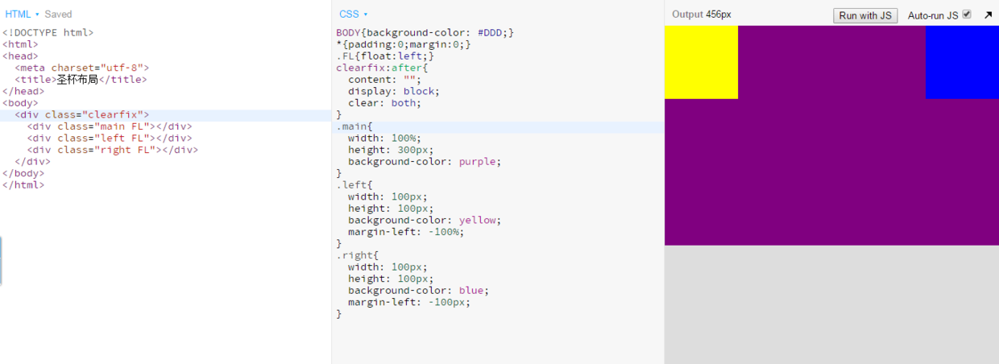
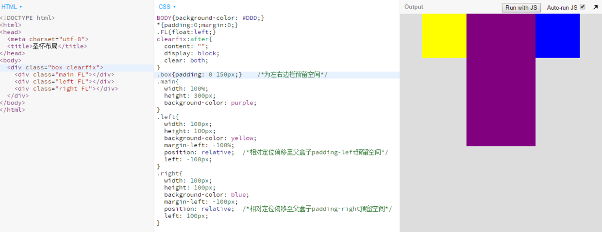
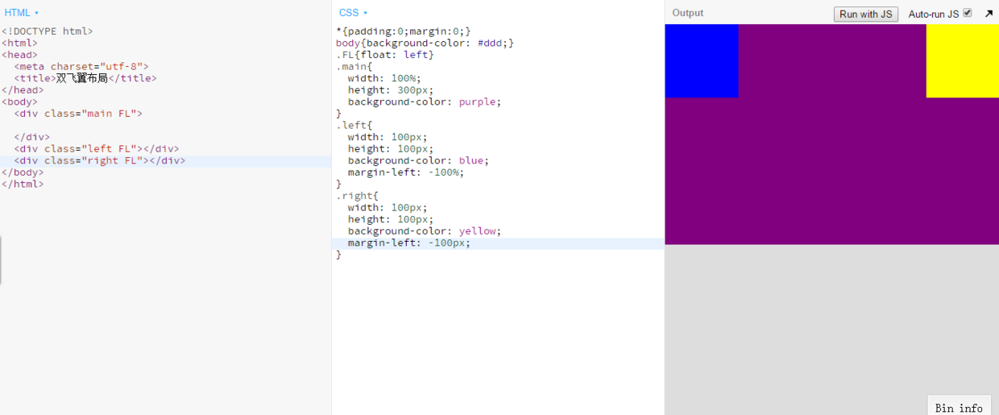
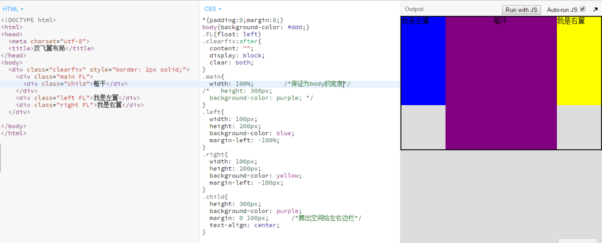

## 问答

---
### 1. 负边距在让元素产生偏移时和position: relative有什么区别?
主要区别在于：
* 偏移参照物不同
    * 负边距以边框外边缘到兄弟元素的边框外边缘或者到父元素边框内边缘为准。
    * 相对定位是相对于自己原来的位置为准。
* 对其它元素的影响不同
    * 负边距随着偏移，相邻的元素也会跟着偏移。
    * 相对定位由于占据着原来的位置，所以无论如何偏移，对其他元素都无影响。

### 2. 使用负 margin 形成三栏布局有什么条件?
需要具备的如下：
* 父盒子里有3个子盒子，所有盒子需要左浮动。
* 子盒子中的长兄作为三栏中的中心栏，需要width:100%。
* 作为左右两边栏的子盒子需要设置margin-left，左边值为100%，右边值为该盒子本身宽度。

### 3. 圣杯布局的原理是怎样的? 简述实现圣杯布局的步骤
圣杯布局的原理依托题2，然后再使用父盒子padding给左右边栏的盒子预留宽度、边栏盒子再使用相对定位偏移至预留的宽度，实现形状如圣杯的三栏布局。步骤如下：
* 先形成一个三栏布局条件，如下：

  

* 父盒子padding预留空间，左右边栏相对定位偏移至预留空间，如下：

  

[圣杯布局](http://js.jirengu.com/neceduwazi/1/edit?html,css,output)

### 4. 双飞翼布局的原理? 实现步骤?
双飞翼布局原理依托题2，然后在中间栏的盒子里再创建一个子盒子，子盒子设置margin为左右边栏预留空间即可。步骤如下：
* 先形成一个三栏布局条件，如下：

  

* 中间栏盒子创建一个子盒子并且给其设置margin为左右栏腾空间，如下：

  

[双飞翼布局](http://js.jirengu.com/puyewoyipo/1/edit?html,css,output)

## 代码

---
[task12-1](https://github.com/jirengu-inc/jrg-renwu7/blob/master/members/%E8%B5%96%E9%9C%84/task-12/task12-1.html)
[task12-1 preview](http://book.jirengu.com/jirengu-inc/jrg-renwu7/members/%E8%B5%96%E9%9C%84/task-12/task12-1.html)

[task12-2](https://github.com/jirengu-inc/jrg-renwu7/blob/master/members/%E8%B5%96%E9%9C%84/task-12/task12-2.html)
[task12-2 preview](http://book.jirengu.com/jirengu-inc/jrg-renwu7/members/%E8%B5%96%E9%9C%84/task-12/task12-2.html)

[task12-3](https://github.com/jirengu-inc/jrg-renwu7/blob/master/members/%E8%B5%96%E9%9C%84/task-12/task12-3.html)
[task12-3 preview](http://book.jirengu.com/jirengu-inc/jrg-renwu7/members/%E8%B5%96%E9%9C%84/task-12/task12-3.html)

[task12-4](https://github.com/jirengu-inc/jrg-renwu7/blob/master/members/%E8%B5%96%E9%9C%84/task-12/task12-4.html)
[task12-4 preview](http://book.jirengu.com/jirengu-inc/jrg-renwu7/members/%E8%B5%96%E9%9C%84/task-12/task12-4.html)

[task12-5](https://github.com/jirengu-inc/jrg-renwu7/blob/master/members/%E8%B5%96%E9%9C%84/task-12/task12-5.html)
[task12-5 preview](http://book.jirengu.com/jirengu-inc/jrg-renwu7/members/%E8%B5%96%E9%9C%84/task-12/task12-5.html)

---
**本文章著作权归九霄所有，转载须说明来源**
