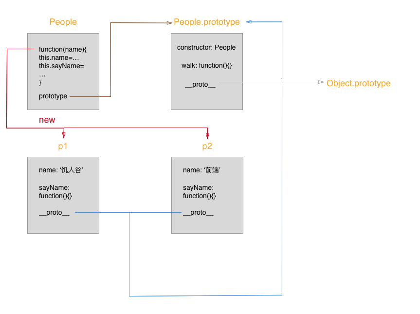
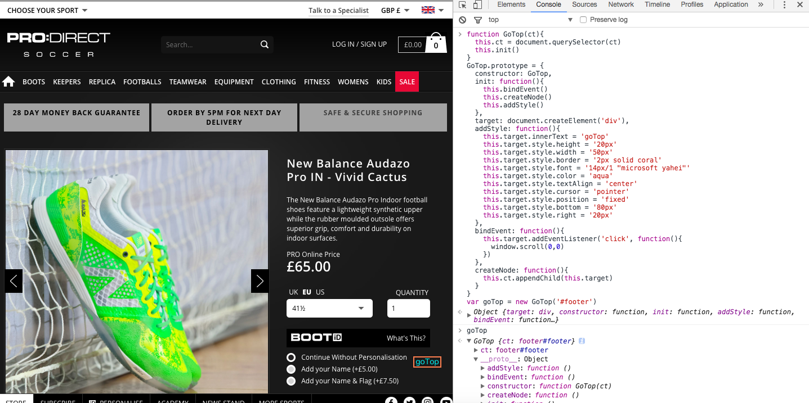

## 问答

---
### 1. OOP 指什么？有哪些特性
#### OOP——Object Oriented Programming
面向对象编程，就是把具有共同特征的事物概括为一个模型的一种思想，具有同种特征的类构造出的实例就是对象。
#### 特征
* 封装性
  隐藏了方法实现的过程，只是暴露接口用于外部调用。   
* 继承性
  生成的实例继承类的属性和方法，是一种复用，节省了内存。
* 多态性
  实例根据需要可以自定义、重定义方法和属性，使实例具有个性的多种形态。
### 2. 如何通过构造函数的方式创建一个拥有属性和方法的对象? 
代码如下：

```
function Human(name){
  this.name = name
}
Human.prototype.p1 = 'being alive'
Human.prototype.sayName = function(){
  console.log('my name is '+this.name)
}
var Male = new Human('messi')
console.log(Male.p1)
console.log(Male.sayName())
```
### 3. prototype 是什么？有什么特性 
#### prototype
prototype是封装了属性和方法的对象，构造函数具有这个属性，实例继承自这个原型对象。
#### 特征
构造函数才具有prototype,实例的`__proto__`指向构造函数的prototype。
### 4. 画出如下代码的原图

```
function People (name){
  this.name = name;
  this.sayName = function(){
    console.log('my name is:' + this.name);
  }
}

People.prototype.walk = function(){
  console.log(this.name + ' is walking');  
}

var p1 = new People('饥人谷');
var p2 = new People('前端');
```
* 如下图
  

### 5. 创建一个 Car 对象，拥有属性name、color、status；拥有方法run，stop，getStatus 
```
function Car(name,color,status){
  this.name = name
  this.color = color
  this.status = status
}
Car.prototype = {
  constructor: Car,
  run: function(){
    console.log('run')
  },
  stop: function(){
    console.log('stop')
  },
  getStatus: function(){
    console.log('my status is ' + this.status)
  }

}
var benz = new Car('benz','red','run')
console.log(benz)
```

### 6. 创建一个 GoTop 对象，当 new 一个 GotTop 对象则会在页面上创建一个回到顶部的元素，点击页面滚动到顶部。拥有以下属性和方法

```
1. `ct`属性，GoTop 对应的 DOM 元素的容器
2.  `target`属性， GoTop 对应的 DOM 元素
3.  `bindEvent` 方法， 用于绑定事件
4. `createNode` 方法， 用于在容器内创建节点
```

```
function GoTop(ct){
  this.ct = document.querySelector(ct)
  this.init()
}
GoTop.prototype = {
  constructor: GoTop,
  init: function(){
    this.bindEvent()
    this.createNode()
    this.addStyle()
  },
  target: document.createElement('div'),
  addStyle: function(){
    this.target.innerText = 'goTop'
    this.target.style.height = '20px'
    this.target.style.width = '50px'
    this.target.style.border = '2px solid coral'
    this.target.style.font = '14px/1 "microsoft yahei"'
    this.target.style.color = 'aqua'
    this.target.style.textAlign = 'center'
    this.target.style.cursor = 'pointer'
    this.target.style.position = 'fixed'
    this.target.style.bottom = '80px'
    this.target.style.right = '20px'
  },
  bindEvent: function(){
    this.target.addEventListener('click', function(){
      window.scroll(0,0)
    })
  },
  createNode: function(){
    this.ct.appendChild(this.target)
  }
}
var goTop = new GoTop()
```
* 预览
  

---
**本文章著作权归及霄所有，转载须说明来源**


